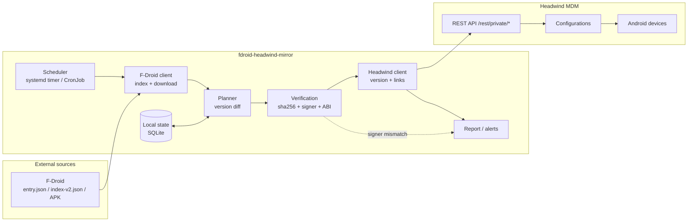
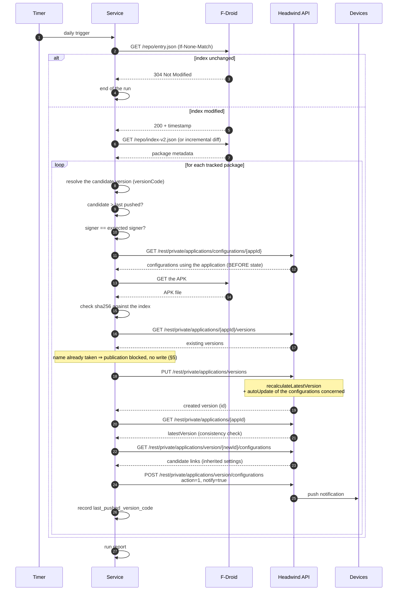
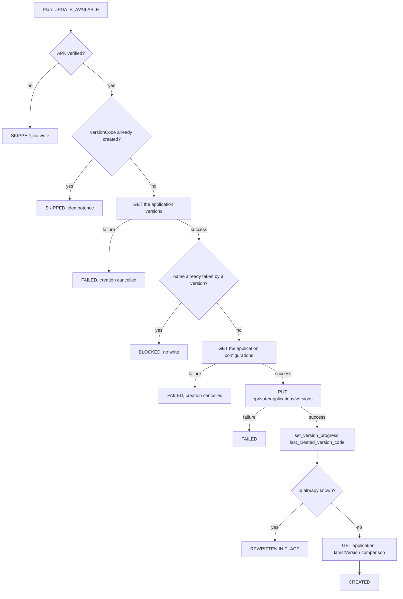
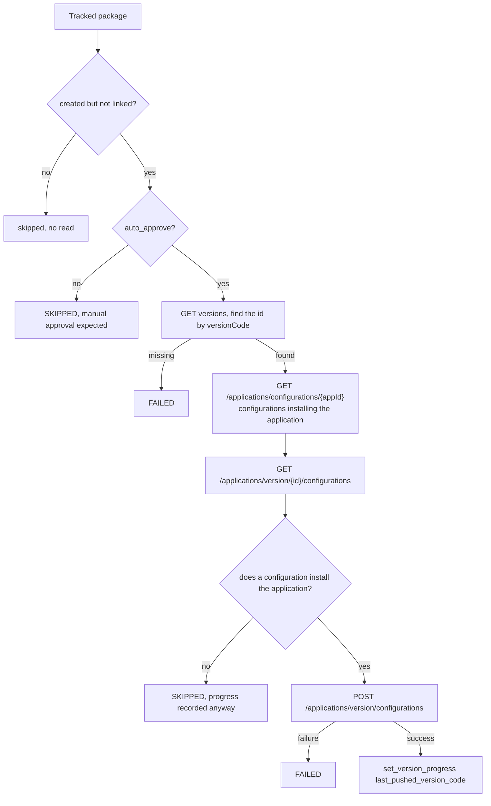

# fdroid-headwind-mirror — Design

## TL;DR

A standalone Python service, triggered once a day, which for each explicitly tracked F-Droid package: compares
the version published on F-Droid with the one recorded in Headwind MDM, downloads and verifies the APK, creates a
new `ApplicationVersion` in Headwind, then links that version to the configurations that used the previous
version and notifies the devices.

Key point: **Headwind already does part of the propagation work**. The service therefore does not have to
reimplement the configuration update logic — it mostly has to trigger it correctly and fill its blind spots.

---

## 1. Context

| Element | Role |
| --- | --- |
| F-Droid | Source of the APKs and their metadata (versions, signatures, hashes, ABIs) |
| Headwind MDM | MDM server: stores the applications, their versions, the configurations and the devices |
| `fdroid-headwind-mirror` | The service to build: bridges the two, once a day |

The stated goal: when an F-Droid APK is added to Headwind, the service checks every day whether a newer version
exists, records it in Headwind, and makes it available to the devices through the configurations that already
reference that application.

---

## 2. What Headwind already does (not to be reimplemented)

This section comes from reading the code of [`hmdm-server`](https://github.com/h-mdm/hmdm-server). The rest of
the design depends on it.

### 2.1 `latestVersion` is recalculated automatically

On every `insertApplicationVersion` that actually inserts a row, the server calls
`recalculateLatestVersion(applicationId)`, which sets `applications.latestVersion` to the version with the
highest comparison index. A version whose name already exists is not inserted but rewritten in place, without
this recalculation (§5, "Deduplication by version name").

### 2.2 Propagation to the configurations is partly automatic

Still in `insertApplicationVersion`, if the created version becomes the application's `latestVersion`, the
server runs `doAutoUpdateToApplicationVersion`, whose core is:

```sql
UPDATE configurationApplications
SET applicationVersionId = :newId
WHERE applicationId = :appId
  AND action <> 2
  AND EXISTS (SELECT 1 FROM configurations
              WHERE configurations.id = configurationApplications.configurationId
                AND configurations.autoUpdate IS TRUE)
```

Direct consequences:

- Configurations with `autoUpdate = TRUE` are **moved automatically** to the new version.
- Configurations with `autoUpdate = FALSE` do not move: the service has to handle them.
- **No push notification is sent** on this path. Devices only see the update at their next periodic sync.

This does not lead to two code paths. The `POST /rest/private/applications/version/configurations` described
in §5 covers both cases with the same call: the notification is driven by the request's `notify` flag, not by
whether a change actually happened in the database. For a configuration already moved by the auto-update, the
call purges then reinserts an identical link — the final state is unchanged, and the notification is sent
anyway.

### 2.3 Display settings are inherited server-side

`GET /rest/private/applications/version/{id}/configurations` relies on a query that joins the link of the
previous version (`caPrev`) and applies a `COALESCE`:

```sql
COALESCE(configurationApplications.showIcon,   caPrev.showIcon, applications.showIcon) AS showIcon,
COALESCE(configurationApplications.screenOrder, caPrev.screenOrder)                     AS screenOrder,
COALESCE(configurationApplications.keyCode,     caPrev.keyCode)                         AS keyCode,
COALESCE(configurationApplications.bottom,      caPrev.bottom)                          AS bottom,
COALESCE(configurationApplications.longTap,     caPrev.longTap)                         AS longTap
```

The service therefore does **not** have to copy the icon order, the keycode or the visibility itself: it sends
back the entries it keeps as they are, setting only `action` and `notify`.

**The action, however, is not inherited.** The same query reads `configurationApplications.action AS action`
from the requested version's link only: `caPrev` only feeds the display settings above. Since the server model
declares `int action`, a configuration without a link to this version comes back with `action = 0`, "do not
install". For a new version this is the case for **all** configurations, as the panel itself notes in a
comment; it only takes over the action of the other versions by copying the one from the application's links
(`GET /private/applications/configurations/{id}`). It is therefore up to the service to designate the
configurations where the version gets installed (§12.2).

### 2.4 Replacing the old version is handled

`updateApplicationVersionConfigurations` first purges the target version's links, then for each link with
`action = 1` runs `uninstallOtherVersions`, which deletes the links of the other versions of the same package
in the configuration (keeping those marked `action = 2`, i.e. "to uninstall"). There is therefore no risk of a
duplicate version in a configuration.

### 2.5 The APK does not need to be hosted by Headwind

In `insertApplicationVersion`, file handling is conditional:

```java
final String filePath = applicationVersion.getFilePath();
if (filePath != null && !filePath.trim().isEmpty()) { /* move + APK analysis */ }
```

A version created with only a `url` is accepted: this is the chosen mode (§8), and it spares the service from
ever sending a file to Headwind.

---

## 3. Overall architecture



### Principles

1. **Explicit opt-in.** The service only touches the packages declared in its tracking list. It never infers
   "this Headwind application has a `pkg` that exists on F-Droid, so I update it" — which would for instance
   overwrite an APK signed by the Play Store with an APK signed by F-Droid.
2. **Stateless in Headwind.** Headwind remains the source of truth for the fleet. The local state is only used
   for tracking (expected signer, last pushed version, run history).
3. **Idempotent.** Running again on a fleet that is already up to date produces no write.
4. **Isolated failure.** A package in error does not interrupt the processing of the others.

---

## 4. Flow of a daily run



### Call order: a point not to invert

Reading the configurations that use the application (`GET /rest/private/applications/configurations/{appId}`)
must happen **before** the new version is created. Afterwards, `doAutoUpdateToApplicationVersion` may already
have moved the links of the `autoUpdate = TRUE` configurations to the new version, which makes it impossible to
tell after the fact which configurations actually used the application.

### Consistency check on `latestVersion`

After creating the version, the service reads the application again and compares `latestVersion` with the id of
the version it has just created. If the two differ, the server-side version ranking did not select the new
version (see §7.4): the auto-update did not fire, and the service must then force the link explicitly. This
check makes the service robust against exotic version formats.

The comparison only holds for a new id. An id that existed before the call signals an in-place rewrite (§5),
which leaves `latestVersion` unchanged by construction: it is reported as such, never as a switch.

---

## 5. Headwind API used

All routes are prefixed with `/rest` and require the `Authorization: Bearer <token>` header.

| Step | Method | Path | Required permission |
| --- | --- | --- | --- |
| List the applications | `GET` | `/private/applications/search` | `applications` |
| Application details | `GET` | `/private/applications/{id}` | `applications` |
| Versions of an application | `GET` | `/private/applications/{id}/versions` | `applications` |
| Configurations of an application | `GET` | `/private/applications/configurations/{id}` | `applications` |
| APK upload (step 1) | `POST` | `/private/web-ui-files` (multipart `file`) | `edit_files` |
| APK validation (step 2) | `POST` | `/private/web-ui-files/update` | `edit_files` |
| Version creation | `PUT` | `/private/applications/versions` | `edit_application_versions` |
| Candidate links of the version | `GET` | `/private/applications/version/{id}/configurations` | `applications` |
| Linking to the configurations | `POST` | `/private/applications/version/configurations` | `edit_application_versions` |

### Body of `PUT /rest/private/applications/versions`

```json
{
  "applicationId": 42,
  "version": "1.4.2",
  "versionCode": 10402,
  "url": "https://mdm.example.org/files/org.example.app-10402.apk",
  "split": false
}
```

No `id` ⇒ creation, **unless a version with the same name already exists** (next section). For a package
published per ABI, send `split: true` with `urlArmeabi` and `urlArm64` instead.

### Deduplication by version name

`insertApplicationVersion` (`ApplicationDAO`) first looks for a same-name version: `getDuplicateAppVersion`
calls `getDuplicateVersionForApp(appId, -1, version)`, whose query is

```sql
SELECT COALESCE(
  (SELECT id FROM applicationVersions
   WHERE applicationId = :appId AND version = :version AND id <> -1), 0)
```

The lookup covers **all** the versions of the application, not only the latest, and compares the `version`
string exactly. When it finds one, the server takes over the id found and runs `updateApplicationVersion` on the
existing row instead of inserting a new one:

| Element | After the rewrite |
| --- | --- |
| `version`, `versionCode`, `split` | values from the request |
| `url` | value from the request, hence `NULL` for a split version |
| `urlArmeabi`, `urlArm64` | values from the request; for a split version, the architecture missing from the request keeps the URL of the old row |
| `apkHash` | erased, since the request carries none |
| The application's `latestVersion` | unchanged: this path does not call `recalculateLatestVersion` |
| `configurationApplications` links | kept; if the row is the `latestVersion`, the auto-update (§2.2) applies as well |

The response returns the existing row, hence an id that existed before the call.

On the device side, the launcher compares the `versionCode` values as soon as the configuration's is non-null
and non-zero (`InstallUtils.areVersionsEqual`), and the names otherwise. A version entered without a code
(`versionCode` 0), then rewritten with a real code, therefore stops being recognised as installed: every device
of the configurations linked to that row reinstalls the application at its next sync, **without any linking**.
`auto_approve: false` then no longer has any effect.

The service draws three rules from this:

1. **Read right before writing.** The publisher reads the full version list of the application again right
   before the `PUT`, rather than reusing the plan's, which the APK verification may have made stale. A version
   carrying exactly the candidate's name blocks the publication, **whatever `auto_approve` says**: no write
   call, a `blocked` outcome, a `WARNING` event `publish.rewrite_blocked` naming the existing version.
   `sync --dry-run` already flags the conflict (the plan's `same_name_version_id` field).
2. **After-the-fact detection.** If the `PUT` returns an id that was in the list just read, the publication is
   reported as an in-place rewrite (`rewritten`, `WARNING` event `publish.rewritten`), never as a creation nor
   as a `latestVersion` switch. `last_created_version_code` is recorded all the same: the write happened, and
   leaving it out would have it repeated on every run.
3. **Neither `blocked` nor `rewritten` is an error.** Like a pending approval, they are pending human
   decisions: the exit code ignores them, but the `sync` summary and the `sync.finished` log line carry
   `publications_blocked` and `versions_rewritten`, which makes them detectable under a timer. `fhm report`,
   which only reads the local state, does not show them.

Blocking with `auto_approve: true` as well is deliberate:

- the rewrite erases the old build with no way back, and Headwind cannot hold two versions with the same
  name;
- applied to an old version, it changes what configurations deliberately left on that version install, without
  `latestVersion` moving.

A third reason motivated this choice and no longer applies: linking then sent back every row of the version,
including those of the configurations that did not install the application, and the server inserted them
unfiltered. It now only sends the configurations where the application is installed (§12.2, decision 2).

The cost is accepted: a rebuild published by F-Droid under the same `versionName` with a higher `versionCode`
is never delivered automatically. With linking fixed, relaxing the rule for `auto_approve: true` is now open
for discussion when the same-name version is the `latestVersion`: only the loss of the old build would then
remain.

The conflict is resolved in Headwind, by an operator: they accept the rewrite by editing the existing version
themselves, or free the name by renaming or deleting it, after which the service creates the version normally.

Residual limit: a same-name version appearing between the re-read and the `PUT` escapes both checks, since its
id is unknown to the service. The window is limited to the configurations read that separates them.

### Body of `POST /rest/private/applications/version/configurations`

```json
{
  "applicationVersionId": 137,
  "configurations": [
    {
      "configurationId": 7,
      "applicationId": 42,
      "applicationVersionId": 137,
      "action": 1,
      "notify": true,
      "showIcon": true,
      "screenOrder": 3,
      "keyCode": null,
      "bottom": false,
      "longTap": false
    }
  ]
}
```

Each entry sent is the one returned by the corresponding `GET`, **sent back as is**, only `action` and `notify`
being set by the service; not all of them are sent (§12.2). The entries that come back with a non-null `id`
(existing links of this version) are sent back with that `id`: the server's `INSERT` has no `id` column, so it
is simply ignored.

Four pitfalls:

- `versionText` is declared `int` server-side and actually receives the numeric id of the version
  (`applicationVersions.id AS versionText` in the query). Putting a string such as `"1.4.2"` there causes a
  deserialization error.
- The call **replaces the links of the target version only**: it purges the links of `applicationVersionId`,
  then reinserts the ones sent. An omitted configuration keeps its links to the other versions, since
  `uninstallOtherVersions` only runs for the configurations sent with `action = 1`: the omission simply leaves
  it on the old version. However, an existing link of the target version disappears if it is omitted — hence
  the systematic resending of those carrying `action = 2`.
- Corollary: for a configuration to switch, it **must** be in the call. All the target configurations are
  therefore sent in a single request.
- `insertApplicationVersionConfigurations` inserts **every** entry it receives, unfiltered: an entry with
  `action = 0` creates a "do not install" link in a configuration that did not install the application. The
  panel never sends such entries, and neither does the service.

### Authentication

The service logs in with a **login and a password** on `POST /rest/public/jwt/login`, and presents the JWT it
obtains as `Authorization: Bearer` on every subsequent call.

```json
{"login": "fdroid-mirror", "password": "<UPPERCASE hexadecimal MD5>"}
```

The server answers `{"id_token": "..."}`, and repeats the token in an `Authorization` response header. The
account does not need to have signed in to the panel beforehand: if its `authToken` is empty, this first login
generates it through `UPDATE users SET password = <value already stored>, authToken = ...`, thus without
touching the password.

Three properties of this endpoint shape the implementation:

- **The `password` field carries an MD5 digest, not the password.** `PasswordUtil.passwordMatch` compares
  `SHA1(received_value + salt)` with the stored password, and `getHashFromRaw` feeds that computation with
  `MD5(password)`. Case matters: `CryptoUtil.getHexString` produces uppercase, so a lowercase digest gives a
  different SHA1, hence a `401`.
- **The token lasts 24 h** (`jwt.validity`, default value `86400`), whereas a run lasts a few minutes: a single
  authentication per run is enough, with no renewal.
- **A failed login locks the account for one second** (`lastLoginFail`), and each failure is already slowed
  down by a one-second `sleep` server-side. An immediate retry after a `401` would therefore fail even with the
  right credentials: the service does not retry.

> [!WARNING]
> The `authToken` of the `users` table **is not** a login credential. `AuthFilter` requires an HTTP session on
> `/rest/private/*` and only reads it to invalidate stale sessions; presenting it as a `Bearer` answers
> `HTTP 403`. An earlier design relied on this token — the error only showed up on the first call against a
> real instance.

---

## 6. F-Droid API used

| Use | Endpoint |
| --- | --- |
| Change detection | `GET {repo}/entry.json` with `If-None-Match` / `If-Modified-Since` |
| Full metadata | `GET {repo}/index-v2.json` |
| Incremental updates | `GET {repo}/diff/{timestamp}.json` |
| Download | `GET {repo}/{apkName}` |

The `GET https://f-droid.org/api/v1/packages/{pkg}` endpoint gives the `suggestedVersionCode` cheaply but
**provides neither the signer, nor `nativecode`, nor the hash**. Since version resolution cannot rely on the
`suggestedVersionCode` alone anyway (§7.2), this endpoint is not used: the index is the only source.

### Volumes

Measurements taken on 2026-09-16 on the official repository:

| Resource | Size | Note |
| --- | --- | --- |
| `entry.json` | 1.9 kB | `ETag` and `Last-Modified` present |
| `index-v2.json` | 19 MB gzipped, 60 MB uncompressed | 4,385 packages |
| `diff/{timestamp}.json` | 0.5 to 5.5 MB | 10 diffs offered, `maxAge` of 14 days |

Downloading the full index every day for a handful of packages is disproportionate. The strategy therefore has
three stages: a conditional `entry.json`, then an incremental diff if the last applied index is among the diffs
offered, and a fallback to the full index otherwise.

### Applying a diff

A diff **is not a dictionary merge**: a `null` value means "delete this key". In one observed diff, 158
versions were removed this way. A naive merge would leave obsolete versions in the local index and could bring
an APK removed from the repository back as a publication candidate. The merge must be recursive and treat
`null` as a deletion.

### Integrity check

`entry.json` provides the expected `sha256` of the index as well as of each diff. These hashes are checked
before any parsing.

The service must remain repository-agnostic: `repo_url` is configuration data, so as to support the official
F-Droid repository, IzzyOnDroid or an internal repository.

### Repository fingerprint — open point

The fingerprint of the repository's signing key is declared in the configuration (`repo.fingerprint`) but **is
not verified yet**. The service consumes `entry.json`, which is not signed; `entry.jar` is what carries the JAR
signature and the GPG signature. Checking it therefore means validating a JAR manifest and a PKCS#7 structure,
work out of proportion for iterations 2 and 3 and handled separately.

As things stand, protection relies on HTTPS and on the hash chain: `entry.json` provides the sha256 of the
index, and the index provides that of each APK. An attacker able to forge the index could redirect the service
to arbitrary APKs; this is the known limit, stated in the README.

The APK certificate is deliberately not re-extracted. If the downloaded bytes match the hash in the index, the
signer assertion carried by the index holds for those exact bytes. Re-deriving the certificate would only guard
against a forged index — which would simply declare the signer of the forged APK — and would only cover APKs
signed with v1, excluding the recent packages signed with v2/v3 only.

---

## 7. Pitfalls

### 7.1 Signature: a correctness constraint, not a convenience

Android rejects any update whose signing certificate differs from that of the installed application
(`INSTALL_FAILED_UPDATE_INCOMPATIBLE`). Yet F-Droid signs with its own key, and **the signer of a package can
change from one version to the next** (a switch to reproducible builds signed by the upstream author, for
example).

The risk is measurable: of the 4,385 packages in the official repository, **17 show at least two distinct
signers across their versions**. It is rare, but each of these cases would cause an install failure on all the
devices concerned.

Rules adopted:

- The field is `manifest.signer.sha256`, and it is **an array**. Across the 4,385 packages surveyed, no version
  declares several, and 3 versions declare none. The service therefore requires exactly one entry: any other
  cardinality is rejected, rather than silently arbitrated.
- The signer is pinned when the package is put under tracking. `metadata.preferredSigner`, present on 4,384 of
  the 4,385 packages, serves as the reference value for pinning.
- On every run, if the signer of the candidate version differs: **rejection, alert, no write to Headwind**.
  Unblocking is an explicit human action (coordinated reinstallation).

This is what justifies opt-in tracking: applying this service to an application installed from another source
would guarantee a silent install failure across the whole fleet.

### 7.2 Comparison on `versionCode`, after grouping by ABI

The comparison is made on `manifest.versionCode` (an integer), never on the version string.

F-Droid's `suggestedVersionCode` **cannot be used as is**: it designates the preferred version for a client that
already filters by the ABI of its device. For a package publishing one APK per architecture, it therefore simply
points to the ABI with the highest `versionCode` — often `x86_64`. VLC illustrates it:

| `versionCode` | `versionName` | `nativecode` |
| --- | --- | --- |
| 13070108 | 3.7.1 | `x86_64` |
| 13070107 | 3.7.1 | `x86` |
| 13070106 | 3.7.1 | `arm64-v8a` |
| 13070105 | 3.7.1 | `armeabi-v7a` |

Picking the highest `versionCode` would publish the x86_64 APK on an ARM fleet. The rule is therefore: **group
by ABI, then take the highest `versionCode` within each targeted ABI**.

The key order of the `versions` object is not a reliable source either: it matches descending `versionCode` in
4,382 cases out of 4,385, but diverges in 3. The sort is therefore explicit.

### 7.3 Per-ABI APKs

A package may publish several APKs per architecture, with distinct `versionCode` values. The
`manifest.nativecode` field of each version gives the ABIs covered. Distribution measured over the 4,385
packages, based on the version with the highest `versionCode`:

| Shape | Packages | Handling |
| --- | --- | --- |
| No `nativecode` (pure Java) | 1,984 | `split = false`, a single `url` field |
| Multi-ABI `nativecode` (native universal) | 1,882 | `split = false`, a single `url` field |
| Single-ABI `nativecode` (per-ABI publication) | 519 | `split = true`, `urlArmeabi` + `urlArm64` |

The split case therefore represents nearly 12% of the repository: it must be handled, not postponed.

ABI mapping, since Headwind only knows two architectures (`Application.ARCH_ARMEABI = "armeabi"` and
`Application.ARCH_ARM64 = "arm64"`):

| F-Droid ABI | Headwind field |
| --- | --- |
| `arm64-v8a` | `urlArm64` |
| `armeabi-v7a`, `armeabi` | `urlArmeabi` |
| `x86`, `x86_64`, `mips`, `riscv64`… | not representable — ignored |

A split package publishing no ARM ABI cannot be deployed on the fleet: it is rejected with an alert rather than
partially published. An error here goes unnoticed on the service side: it shows up as an install failure on the
device.

### 7.4 Version ranking on the Headwind side

`recalculateLatestVersion` relies on the PostgreSQL function `mdm_app_version_comparison_index`, which splits the
version string on `.`, removes every non-digit character from each segment and pads it to 10 digits. The suffix
of a pre-release is therefore absorbed into the number:

| Version | Resulting index (segments) | Effect |
| --- | --- | --- |
| `1.2.3` | `…0000000003` | reference |
| `1.2.3-rc1` | `…0000000031` | considered **newer** than `1.2.3` |

A second effect, more frequent in practice: since the indexes are **concatenations of fixed-width segments**,
two versions that do not have the same number of segments are compared by prefix. `2.1.0` produces 30
characters, `2.2` produces 20; the comparison remains correct here, but a package that drops a segment between
two publications (for example `2.1.0`, then `2.2.0`, then `2.3`) can produce a counter-intuitive ranking as soon
as the common segments are equal. This trigger is independent of the pre-release case, and one more reason not
to rely on the server's ranking.

Two complementary mitigations:

- Never select a pre-release as a candidate (F-Droid's `suggestedVersionCode` already avoids it in the vast
  majority of cases).
- The `latestVersion` consistency check described in §4, which falls back to explicit linking as soon as the
  server has not selected the created version.

### 7.5 Actual deployment latency

`notify: true` triggers `pushService.notifyDevicesOnUpdate(configurationId)`. Two caveats to state clearly
rather than promising an immediate update:

- The push only takes effect if the notification service is configured on the Headwind instance; otherwise the
  devices pick up the update at their next periodic sync.
- The actual installation depends on the rights of the agent on the device (Device Owner for silent
  installation) and on the configured update window.

### 7.6 Approval

Pushing software to a managed fleet is a decision that must be governed. Each tracked package carries an
`auto_approve` flag:

| `auto_approve` | Behaviour |
| --- | --- |
| `true` | The version is created **and** linked to the configurations, with notification |
| `false` | The version is created in Headwind and flagged in the report; linking is left to an operator |

The second mode costs almost nothing to implement, and keeps the service from being switched off at the first
doubt.

In both modes, a candidate whose name is already taken by a Headwind version is not published: creating the
version would rewrite it in place and deploy it without linking (§5, "Deduplication by version name").

#### Consequence for state tracking

This mode creates an intermediate state — "version present in Headwind, not linked" — that a single progress
counter cannot represent. With a single column, both outcomes are bad:

| If progress is recorded after the creation | If it is not |
| --- | --- |
| The next run sees nothing left to do: the pending approval is silently forgotten | The next run retries the creation, runs into `getDuplicateAppVersion` — which **updates** the existing version instead of failing — and alerts again every day |

Hence two distinct columns in §9:

- `last_created_version_code` — the version exists in Headwind;
- `last_pushed_version_code` — the version is linked to the configurations.

A version awaiting approval is exactly one where `last_created_version_code > last_pushed_version_code`. The
next run then skips the creation and merely reminds of the pending approval in the report, without any write.

The rewrite mentioned in the table is not limited to the versions created by the service: any same-name
version, entered by hand for example, is rewritten the same way, configuration links included. This is what
justifies the same-name check described in §5.

---

## 8. APK distribution: direct URL

**Decision: Headwind will never host the APKs.** The published versions carry the URL of the F-Droid
repository, and the devices download the binary themselves. The `mirror` option that exposed both modes has been
removed from the configuration and from the local state (migration `002_drop_mirror.sql`), and iteration 5 is
abandoned.

This decision closes a trade-off that was open in the initial design:

| Criterion | Consequence of the choice |
| --- | --- |
| Network access from the devices | **`f-droid.org` must be reachable from every device** — a hard constraint |
| Availability | Depends on that of the F-Droid repository |
| Reproducibility | Old versions move to the repository's archive, whose URL differs |
| Disk cost on the Headwind side | None, and its quota is never used |
| Complexity | No file upload, no retention policy to maintain |

The service still downloads the APKs, but only to verify their hash before publication (§6): these files stay
in its local cache and are never sent to Headwind.

---

## 9. Local state

SQLite, a single file, enough for the target volumes and with no infrastructure dependency.


The three truly critical columns:

| Column | Role |
| --- | --- |
| `expected_signer` | Carries the correctness guarantee described in §7.1 |
| `last_created_version_code` | Version existing in Headwind — avoids recreating a version already published |
| `last_pushed_version_code` | Version linked to the configurations — makes the deployment idempotent |

The gap between the last two is the "awaiting approval" state (§7.6). They are equal in the nominal case with
`auto_approve: true`.

`last_seen_version_code` is purely informative: it records the last version seen on F-Droid, including rejected
ones (signer mismatch, pre-release), which keeps the report readable without having to read the index again.

The list of tracked packages comes from a versioned declarative file (`packages.yaml`), applied to the database
at startup. This makes tracking auditable and reproducible:

```yaml
repo:
  url: https://f-droid.org/repo
  fingerprint: 43238d512c1e5eb2d6569f4a3afbf5523418b82e0a3ed1552770abb9a9c9ccab

defaults:
  auto_approve: false

packages:
  - pkg: org.mozilla.fennec_fdroid
    auto_approve: true
  - pkg: com.nextcloud.client
  - pkg: org.videolan.vlc
```

---

## 10. Technical stack and structure

Python 3.12 + Poetry, in line with the conventions in force (`pylint`, `black`, strict type annotations).

| Need | Choice |
| --- | --- |
| HTTP client | `httpx` (explicit timeouts, multipart upload, connection reuse) |
| Data validation | `pydantic` v2 — models for the F-Droid index and for the Headwind entities |
| Persistence | `sqlite3` from the standard library, versioned SQL migrations |
| CLI | `typer` |
| Logging | `structlog` as JSON |
| Scheduling | `systemd` timer (or a Kubernetes `CronJob`) — no embedded scheduler |

```
fdroid_headwind_mirror/
├── cli.py                   # entry points: sync, status, track, untrack
├── config.py                # configuration loading and validation
├── fdroid/
│   ├── client.py            # entry.json, index-v2.json, download
│   ├── models.py            # pydantic models of the index
│   └── resolver.py          # candidate version choice, ABI resolution
├── headwind/
│   ├── client.py            # typed REST client
│   ├── models.py            # Application, ApplicationVersion, links
│   └── errors.py            # API business errors
├── domain/
│   ├── planner.py           # diff: which package must be updated
│   ├── verifier.py          # sha256, signer, ABI consistency
│   └── publisher.py         # orchestration of a version publication
├── state/
│   ├── repository.py        # SQLite access
│   └── migrations/
└── reporting/
    └── report.py            # run report
```

The layers only know each other in one direction: `cli` → `domain` → (`fdroid`, `headwind`, `state`). `domain`
only handles internal models, which makes it possible to test the decision logic without any network call.

### Commands

```bash
poetry run fhm sync --dry-run
poetry run fhm sync
poetry run fhm status
poetry run fhm track org.mozilla.fennec_fdroid --application-id 42
```

`--dry-run` is the default verification command: it performs all the reads and checks, and issues no write to
Headwind.

---

## 11. Security

| Risk | Mitigation |
| --- | --- |
| Compromised repository index | HTTPS and hash chain — the repository fingerprint remains **unverified**, see §6 |
| Index tampered with in transit | sha256 check of the index and of the diffs against `entry.json` |
| APK tampered with in transit | sha256 and size check during the download, before any upload |
| Tampered local cache | Hash recomputed on every reuse, new download if it differs |
| Faulty or hostile mirror | Transfer capped by the size announced in the index |
| Cross-signature update | Signer pinning per package (§7.1) |
| Headwind token leak | Secret injected through an environment variable, never logged, service user with minimal permissions |
| Unwanted deployment | `auto_approve` set to `false` by default, `--dry-run` |
| Network footprint | Outgoing calls limited to the configured repository and to the Headwind instance |

---

## 12. Implementation by iterations

| Iteration | Scope | Done when |
| --- | --- | --- |
| 1 ✅ | Read-only Headwind client + local state + `status` | The service lists the Headwind applications and matches them against `packages.yaml` |
| 2 ✅ | F-Droid client + version resolution + `sync --dry-run` | The service says what it would update, without writing anything |
| 3 ✅ | Verification (sha256, signer, ABI) | A signer mismatch produces an alert and blocks the package |
| 4 ✅ | Publication of a version (direct URL mode) | A new version appears in Headwind |
| 5 ❌ | ~~Mirror mode (APK upload)~~ | Abandoned: Headwind will never host the APKs (§8) |
| 6 ✅ | Linking to the configurations + notification | A test device receives the update |
| 7 ✅ | Scheduling, reporting, monitoring | Autonomous daily run with a usable report |

Iterations 1 to 3 write nothing to Headwind: they validate reading the fleet and resolving the versions without
any risk. Iteration 4 is the first point where a validation on a staging instance is required.

### 12.1 What iteration 4 does exactly

`fhm sync --apply` chains, for each package in `UPDATE_AVAILABLE`:



Five key decisions:

1. **`--apply` enforces the APK verification.** The direct URL mode publishes a pointer that the devices will
   download themselves; publishing without having computed the hash of the bytes served would amount to
   asserting an integrity never observed. An unverified artefact produces no write.
2. **The configurations are read before the creation** (§4). A configuration carrying `autoUpdate` switches to
   the new version on insertion: afterwards, the previous state can no longer be observed.
3. **`last_created_version_code` is written before the consistency check.** If the re-read fails while the
   `PUT` succeeded, the lack of a trace would republish the same version on the next run.
4. **`latestVersion` is read again and compared** with the created id. If it has not switched, the string sort
   of `mdm_app_version_comparison_index` (§7.4) did not select the version: `doAutoUpdateToApplicationVersion`
   therefore propagated nothing, and the explicit linking of iteration 6 becomes mandatory for that package.
   Since the plan keeps proposing the update on the following runs, the idempotence guard then tells "already
   created" apart from "already created but not adopted", so that the daily report does not go silent again on a
   stuck package.
5. **A same-name candidate is never published.** Headwind would rewrite the version with the same name in place,
   configuration links included, and its devices would receive the build without linking (§5). The check is
   repeated right before the `PUT` on a fresh list, and an id returned that is already known is reported as a
   rewrite, never as a creation.

An accepted `PUT` whose response is unusable (`data` missing or of another shape) is treated as a creation:
since `_put` has already raised for an error envelope, the write did happen. Only the consistency check becomes
impossible. The exact shape of this response remains to be confirmed (§13).

Out of the scope of iteration 4: linking to the configurations, covered in 12.2.

### 12.2 What iteration 6 does exactly

After the publication, `sync --apply` links the versions to the configurations that already installed the
application. Linking does not depend on the status of the plan but on a single state criterion:
`last_created_version_code > last_pushed_version_code`. The same condition therefore covers what has just been
published and what a previous run left unlinked — there are no two recovery paths.



Four key decisions:

1. **The links are read raw and sent back as they are.** `get_version_configurations` returns `dict` objects,
   not models: going through the typed models (`extra="ignore"`) would drop the undeclared fields, and would
   convert `versionText` — an integer server-side — into a string, which its deserialization rejects (§5). This
   is the only read of the client that deliberately escapes typing.
2. **`action` is set where the application is installed, and only there.** Headwind does not carry the action
   over from one version to the next (§2.3): a new version comes back with `0` everywhere. The service therefore
   reads the links of the application across all its versions and, for each configuration where one of them
   carries `action = 1`, sends the entry of the new version with `action = 1` and `notify = true`. An entry of
   the version already marked `action = 2` is sent back as is, without notification: a requested uninstall is
   never undone. No other entry is sent, as in the panel: the server would insert an entry with `0` as it is
   (§5).

   An earlier version of this design took the action to be inherited through the `COALESCE`. Linking then
   found no configuration for a new version and recorded the progress without linking anything; for a version
   already linked, it sent back every configuration, and created `0` links where the application was not
   installed.
3. **The version id is found by `versionCode`**, never taken from the publication: it may be missing (unusable
   creation response), and it does not exist at all when linking resumes the work of a previous run.
4. **Having no configuration to link still records the progress.** Otherwise the package would be reported as
   pending on every run, for a state already reached.

`auto_approve: false` leaves the version created but not linked, reported on every run (§7.6). Approval then
happens in the Headwind interface: the service provides no approval command, which remains a possible
extension.

The notification is **requested**, never observed: `notify: true` only triggers `notifyDevicesOnUpdate` if the
push service is configured on the instance (§7.5, and §13 item 4, still open). The report therefore says
"notification requested" (`notification demandee`) and never "devices notified" — the API does not make it
possible to observe the difference.

### 12.3 What iteration 7 does exactly

Under a timer, nobody reads the standard output. "Usable report" therefore means that a degraded run is
**detectable without human intervention**, through two distinct channels:

| Channel | Content | Recipient |
| --- | --- | --- |
| Exit code | `0` healthy, `1` errors, `2` configuration or service unreachable | the scheduler |
| JSON log on stderr | one line per error, then a `sync.finished` summary | `journalctl`, log collector |
| `fhm report` | durable state: last run, errors, pending packages | an operator |

Four key decisions:

1. **The log is emitted at the CLI boundary**, never from `domain/`. The layers only know each other in one
   direction (§10); the domain already records its events in the database through `record_event`, and the CLI
   reads them back at the end of the run to emit them. No business layer receives a logger.
2. **The log goes to stderr, the report to stdout.** `sync --json` and the log are active at the same time:
   mixing the two streams would make the former impossible to parse.
3. **Pruning is a command, not a side effect.** `sync_event` grows without bound under a daily timer, but a
   scheduled run that silently deleted history would be worse than the problem. `fhm prune --days N` asks for
   confirmation, unless `--yes` is given.
4. **No embedded scheduler** (§10). Sample systemd units are provided in `deploy/`, with the token in an
   `EnvironmentFile`, an explicit `WorkingDirectory` — the default paths are relative — and a
   `RandomizedDelaySec` so as not to concentrate the load on the F-Droid repository.

Out of scope: checking that the published URLs still respond. F-Droid moves old versions from `/repo` to
`/archive`, so a published URL may end up no longer responding — but checking that requires a new network
capability, which belongs to a separate iteration.

---

## 13. Points to validate on the target instance

The following items were established by reading the source code of `hmdm-server` and must be confirmed against
the version actually deployed, through its Swagger (`/swagger-ui.html`):

0. **Uniqueness of `pkg`** — iteration 1 handles the case of several applications carrying the same package
   (`AMBIGU` status, no automatic resolution). Its actual frequency on the fleet remains to be seen: if it is
   common, an explicit disambiguation criterion in `packages.yaml` (for example `application_id`) will become
   necessary.
1. ~~Expected format of the `password` field and state of the `transmitPassword` option.~~ **Settled**: the
   service logs in on `/rest/public/jwt/login` by sending the uppercase hexadecimal MD5 digest of the password,
   and receives a JWT valid for 24 h (see section 5). This point had been wrongly closed as "moot" when the
   design relied on the `authToken`; the first call to a real instance reopened it with an `HTTP 403`. The
   `transmitPassword` option has no effect here: it only appears in `AuthResource` and in the login controller
   of the web panel, never in the `jwt` module.
2. **Content of `data` in the response to `PUT /private/applications/versions`.** The service assumes that it
   carries the created version, but accepts that it may be empty or of another shape: the write is then recorded
   without any possible consistency check. *(This point replaces the one on `FileUploadResult` and on the
   `POST /private/web-ui-files` sequence, now moot: the service sends no file to Headwind, §8.)*
3. Value of `autoUpdate` on the configurations concerned — it determines whether the propagation is automatic
   or whether explicit linking is mandatory. **The most sensitive point of iteration 4**: `sync --apply`
   displays the number of configurations referencing the application before creating the version, but cannot
   read `autoUpdate` itself. As long as this value is not known on the target instance, assume that creating a
   version may trigger an immediate deployment on the fleet.
4. Actual availability of the push notification service.
5. **Verification of the repository fingerprint** (§6) — independent of Headwind, but it is the missing link in
   the chain of trust, to be handled before going to production.
