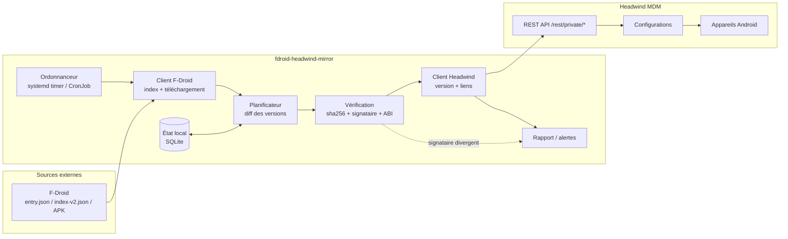
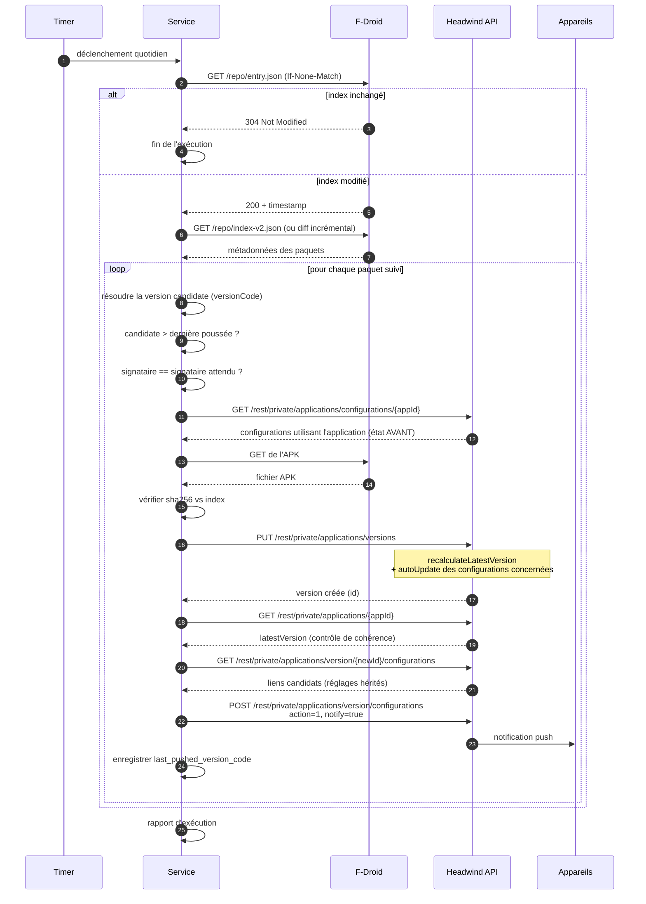
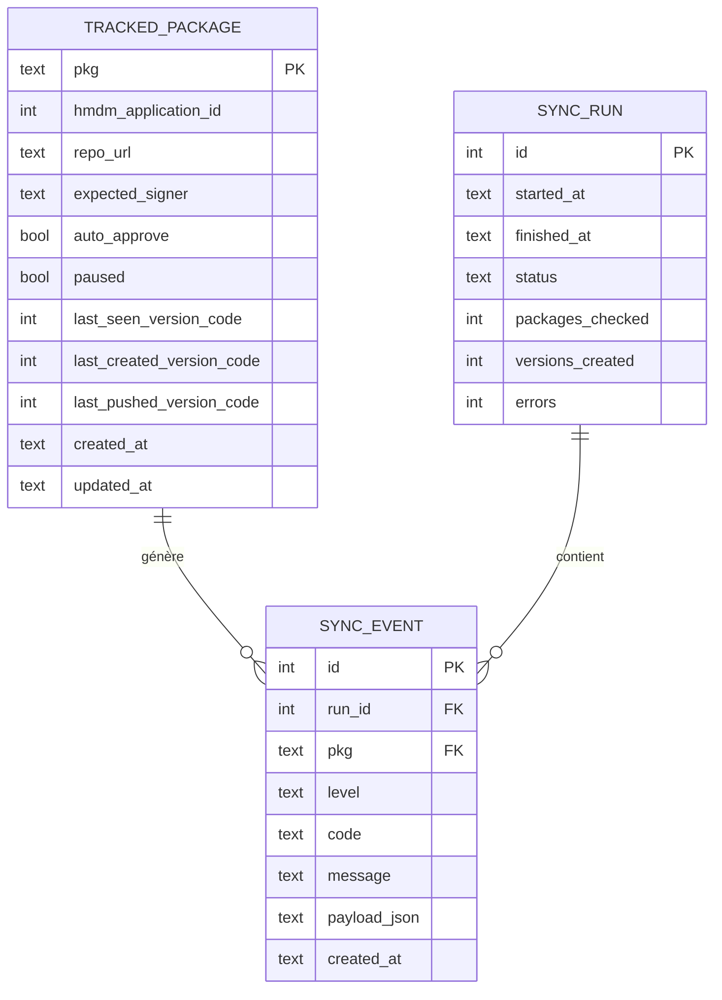
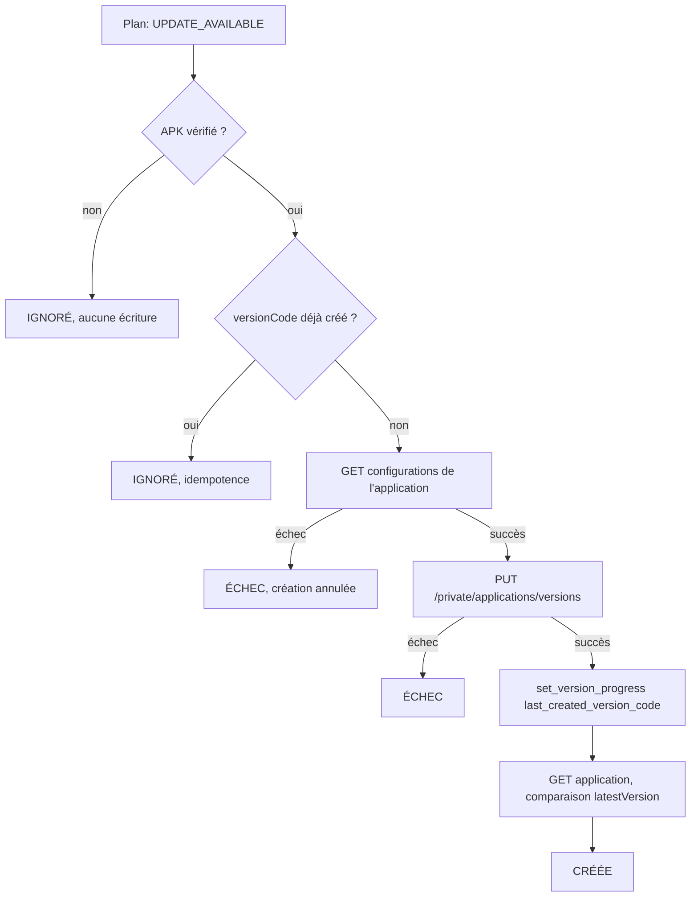
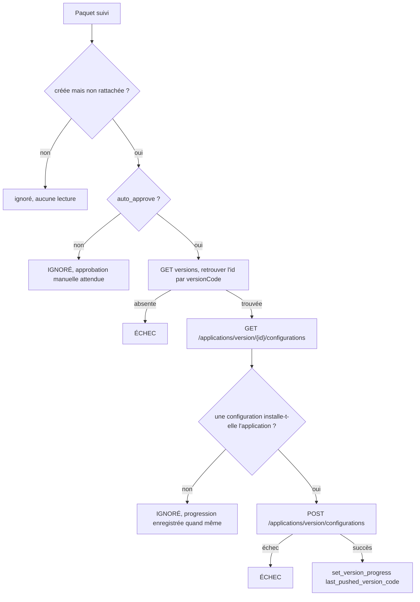

# fdroid-headwind-mirror — Conception

## TL;DR

Un service Python autonome, déclenché une fois par jour, qui pour chaque paquet F-Droid explicitement suivi :
compare la version publiée sur F-Droid à celle enregistrée dans Headwind MDM, télécharge et vérifie l'APK,
crée une nouvelle `ApplicationVersion` dans Headwind, puis rattache cette version aux configurations qui
utilisaient la version précédente et notifie les appareils.

Point structurant : **Headwind fait déjà une partie du travail de propagation**. Le service n'a donc pas à
réimplémenter la logique de mise à jour des configurations — il doit surtout la déclencher correctement et
combler ses angles morts.

---

## 1. Contexte

| Élément | Rôle |
| --- | --- |
| F-Droid | Source des APK et des métadonnées (versions, signatures, hashes, ABI) |
| Headwind MDM | Serveur MDM : stocke les applications, leurs versions, les configurations et les appareils |
| `fdroid-headwind-mirror` | Le service à construire : fait le pont entre les deux, une fois par jour |

L'objectif énoncé : quand un APK F-Droid est ajouté dans Headwind, le service vérifie quotidiennement s'il
existe une version plus récente, l'enregistre dans Headwind, et la rend disponible aux appareils via les
configurations qui référencent déjà cette application.

---

## 2. Ce que Headwind fait déjà (à ne pas réimplémenter)

Cette section est le résultat de la lecture du code de [`hmdm-server`](https://github.com/h-mdm/hmdm-server).
Elle conditionne tout le reste de la conception.

### 2.1 `latestVersion` est recalculé automatiquement

À chaque `insertApplicationVersion`, le serveur appelle `recalculateLatestVersion(applicationId)`, qui
positionne `applications.latestVersion` sur la version dont l'index de comparaison est le plus élevé.

### 2.2 La propagation vers les configurations est partiellement automatique

Toujours dans `insertApplicationVersion`, si la version créée devient la `latestVersion` de l'application,
le serveur exécute `doAutoUpdateToApplicationVersion`, dont le cœur est :

```sql
UPDATE configurationApplications
SET applicationVersionId = :newId
WHERE applicationId = :appId
  AND action <> 2
  AND EXISTS (SELECT 1 FROM configurations
              WHERE configurations.id = configurationApplications.configurationId
                AND configurations.autoUpdate IS TRUE)
```

Conséquences directes :

- Les configurations avec `autoUpdate = TRUE` sont **basculées automatiquement** sur la nouvelle version.
- Les configurations avec `autoUpdate = FALSE` ne bougent pas : c'est au service de les traiter.
- **Aucune notification push n'est émise** par ce chemin. Les appareils ne verront la mise à jour qu'à
  leur prochaine synchronisation périodique.

Il n'en découle pas deux chemins de code. Le `POST /rest/private/applications/version/configurations`
décrit en §5 couvre les deux cas avec le même appel : la notification est pilotée par le drapeau `notify` de
la requête, pas par le fait qu'un changement ait réellement eu lieu en base. Pour une configuration déjà
basculée par l'auto-update, l'appel purge puis réinsère un lien identique — l'état final est inchangé, et la
notification part quand même.

### 2.3 Les réglages d'affichage sont hérités côté serveur

`GET /rest/private/applications/version/{id}/configurations` s'appuie sur une requête qui joint le lien de
la version précédente (`caPrev`) et applique un `COALESCE` :

```sql
COALESCE(configurationApplications.showIcon,   caPrev.showIcon, applications.showIcon) AS showIcon,
COALESCE(configurationApplications.screenOrder, caPrev.screenOrder)                     AS screenOrder,
COALESCE(configurationApplications.keyCode,     caPrev.keyCode)                         AS keyCode,
COALESCE(configurationApplications.bottom,      caPrev.bottom)                          AS bottom,
COALESCE(configurationApplications.longTap,     caPrev.longTap)                         AS longTap
```

Le service n'a donc **pas** à recopier lui-même l'ordre des icônes, le keycode ou la visibilité : il renvoie
tel quel ce que le `GET` lui a retourné, en ne modifiant que `action` et `notify`.

### 2.4 Le remplacement de l'ancienne version est géré

`updateApplicationVersionConfigurations` purge d'abord les liens de la version cible, puis pour chaque lien
avec `action = 1` exécute `uninstallOtherVersions`, qui supprime les liens des autres versions du même
paquet dans la configuration (en préservant ceux marqués `action = 2`, c'est-à-dire « à désinstaller »).
Il n'y a donc pas de risque de doublon de version dans une configuration.

### 2.5 L'APK n'a pas besoin d'être hébergé par Headwind

Dans `insertApplicationVersion`, le traitement de fichier est conditionnel :

```java
final String filePath = applicationVersion.getFilePath();
if (filePath != null && !filePath.trim().isEmpty()) { /* déplacement + analyse APK */ }
```

Une version créée avec uniquement une `url` est acceptée : c'est le mode retenu (§8), et il dispense
entièrement le service d'envoyer un fichier à Headwind.

---

## 3. Architecture générale



### Principes

1. **Opt-in explicite.** Le service ne touche qu'aux paquets déclarés dans sa liste de suivi. Il ne va jamais
   déduire « cette application Headwind a un `pkg` qui existe sur F-Droid, donc je la mets à jour » — ce qui
   écraserait par exemple un APK signé par le Play Store avec un APK signé par F-Droid.
2. **Sans état dans Headwind.** Headwind reste la source de vérité du parc. L'état local ne sert qu'au
   suivi (signataire attendu, dernière version poussée, historique des exécutions).
3. **Idempotent.** Relancer une exécution sur un parc déjà à jour ne produit aucune écriture.
4. **Échec isolé.** Un paquet en erreur n'interrompt pas le traitement des autres.

---

## 4. Flux d'une exécution quotidienne



### Ordre des appels : un point à ne pas inverser

Le relevé des configurations utilisant l'application (`GET /rest/private/applications/configurations/{appId}`)
doit être fait **avant** la création de la nouvelle version. Après celle-ci, `doAutoUpdateToApplicationVersion`
a déjà pu déplacer les liens des configurations `autoUpdate = TRUE` vers la nouvelle version, ce qui rend
impossible de distinguer après coup les configurations qui utilisaient réellement l'application.

### Contrôle de cohérence sur `latestVersion`

Après création de la version, le service relit l'application et compare `latestVersion` à l'identifiant de la
version qu'il vient de créer. Si les deux diffèrent, cela signifie que le classement de versions côté serveur
n'a pas retenu la nouvelle version (voir §7.4) : l'auto-update ne s'est pas déclenché, et le service doit
alors forcer explicitement le lien. Ce contrôle rend le service robuste face aux formats de version exotiques.

---

## 5. API Headwind utilisée

Toutes les routes sont préfixées par `/rest` et requièrent l'en-tête `Authorization: Bearer <token>`.

| Étape | Méthode | Chemin | Permission requise |
| --- | --- | --- | --- |
| Lister les applications | `GET` | `/private/applications/search` | `applications` |
| Détail d'une application | `GET` | `/private/applications/{id}` | `applications` |
| Versions d'une application | `GET` | `/private/applications/{id}/versions` | `applications` |
| Configurations d'une application | `GET` | `/private/applications/configurations/{id}` | `applications` |
| Envoi de l'APK (étape 1) | `POST` | `/private/web-ui-files` (multipart `file`) | `edit_files` |
| Validation de l'APK (étape 2) | `POST` | `/private/web-ui-files/update` | `edit_files` |
| Création de la version | `PUT` | `/private/applications/versions` | `edit_application_versions` |
| Liens candidats de la version | `GET` | `/private/applications/version/{id}/configurations` | `applications` |
| Rattachement aux configurations | `POST` | `/private/applications/version/configurations` | `edit_application_versions` |

### Corps de `PUT /rest/private/applications/versions`

```json
{
  "applicationId": 42,
  "version": "1.4.2",
  "versionCode": 10402,
  "url": "https://mdm.example.org/files/org.example.app-10402.apk",
  "split": false
}
```

`id` absent ⇒ création. Pour un paquet publié par ABI, on envoie plutôt `split: true` avec `urlArmeabi` et
`urlArm64`.

### Corps de `POST /rest/private/applications/version/configurations`

```json
{
  "applicationVersionId": 137,
  "configurations": [
    {
      "configurationId": 7,
      "applicationId": 42,
      "applicationVersionId": 137,
      "action": 1,
      "notify": true,
      "showIcon": true,
      "screenOrder": 3,
      "keyCode": null,
      "bottom": false,
      "longTap": false
    }
  ]
}
```

Chaque entrée est celle retournée par le `GET` correspondant, **réémise telle quelle**, seuls `action` et
`notify` étant positionnés par le service. Les entrées qui reviennent avec un `id` non nul (configurations
déjà basculées par l'auto-update) sont renvoyées avec cet `id` : l'`INSERT` du serveur ne comporte pas la
colonne `id`, qui est donc simplement ignorée.

Trois pièges :

- `versionText` est déclaré `int` côté serveur et reçoit en réalité l'identifiant numérique de la version
  (`applicationVersions.id AS versionText` dans la requête). Y placer une chaîne comme `"1.4.2"` provoque une
  erreur de désérialisation.
- L'appel est **remplaçant pour la version ciblée uniquement** : il purge les liens de `applicationVersionId`
  puis réinsère ceux transmis. Une configuration omise de la liste ne perd rien — elle conserve son lien vers
  l'ancienne version, car `uninstallOtherVersions` ne s'exécute que pour les configurations effectivement
  transmises avec `action = 1`. L'omission est donc inerte, pas destructrice : elle laisse simplement la
  configuration sur l'ancienne version.
- Corollaire : pour qu'une configuration bascule, elle **doit** figurer dans l'appel. Toutes les
  configurations cibles sont donc envoyées en une seule requête.

### Authentification

`POST /rest/public/auth/login` avec `{"login": "...", "password": "..."}` retourne un `UserView` contenant un
champ `authToken` **persistant** (il n'est régénéré que s'il est vide). L'approche recommandée :

1. Créer un utilisateur de service dédié dans Headwind, avec les seules permissions du tableau ci-dessus.
2. Récupérer son `authToken` une fois pour toutes.
3. Le stocker comme secret et l'utiliser en `Authorization: Bearer`.

Cela évite au service de manipuler un mot de passe. Deux points à valider sur l'instance cible avant
implémentation : le format attendu du champ `password` (le commentaire du code indique que le panneau web
transmet une empreinte MD5) et l'éventuelle activation de `transmitPassword`, qui impose un chiffrement RSA.
Le Swagger de l'instance (`/swagger-ui.html`) est la référence à jour.

---

## 6. API F-Droid utilisée

| Usage | Endpoint |
| --- | --- |
| Détection de changement | `GET {repo}/entry.json` avec `If-None-Match` / `If-Modified-Since` |
| Métadonnées complètes | `GET {repo}/index-v2.json` |
| Mises à jour incrémentales | `GET {repo}/diff/{timestamp}.json` |
| Téléchargement | `GET {repo}/{apkName}` |

L'endpoint `GET https://f-droid.org/api/v1/packages/{pkg}` donne le `suggestedVersionCode` à faible coût mais
**ne fournit ni le signataire, ni `nativecode`, ni le hash**. Comme la résolution de version ne peut de toute
façon pas s'appuyer sur le `suggestedVersionCode` seul (§7.2), cet endpoint n'est pas utilisé : l'index est
l'unique source.

### Volumétrie

Mesures relevées le 2026-09-16 sur le dépôt officiel :

| Ressource | Taille | Remarque |
| --- | --- | --- |
| `entry.json` | 1,9 ko | `ETag` et `Last-Modified` présents |
| `index-v2.json` | 19 Mo en gzip, 60 Mo décompressé | 4 385 paquets |
| `diff/{timestamp}.json` | 0,5 à 5,5 Mo | 10 diffs proposés, `maxAge` de 14 jours |

Télécharger l'index complet chaque jour pour une poignée de paquets est disproportionné. La stratégie est
donc en trois temps : `entry.json` conditionnel, puis diff incrémental si le dernier index appliqué figure
parmi les diffs proposés, et repli sur l'index complet sinon.

### Application d'un diff

Un diff **n'est pas une fusion de dictionnaires** : une valeur `null` signifie « supprimer cette clé ». Sur un
diff observé, 158 versions étaient ainsi retirées. Une fusion naïve laisserait des versions obsolètes dans
l'index local et pourrait ressusciter un APK retiré du dépôt comme candidat à la publication. La fusion doit
être récursive et traiter `null` comme une suppression.

### Vérification d'intégrité

`entry.json` fournit le `sha256` attendu de l'index comme de chaque diff. Ces empreintes sont vérifiées avant
tout parsing.

Le service doit rester agnostique du dépôt : `repo_url` est une donnée de configuration, afin de supporter
F-Droid officiel, IzzyOnDroid ou un dépôt interne.

### Empreinte du dépôt — point ouvert

L'empreinte de la clé de signature du dépôt est déclarée en configuration (`repo.fingerprint`) mais **n'est
pas encore vérifiée**. Le service consomme `entry.json`, qui n'est pas signé ; c'est `entry.jar` qui porte la
signature JAR et la signature GPG. La contrôler suppose donc de valider un manifeste JAR et une structure
PKCS#7, travail disproportionné pour les itérations 2 et 3 et traité à part.

En l'état, la protection repose sur HTTPS et sur la chaîne d'empreintes : `entry.json` fournit le sha256 de
l'index, l'index fournit celui de chaque APK. Un attaquant capable de falsifier l'index pourrait rediriger le
service vers des APK arbitraires ; c'est la limite connue, énoncée dans le README.

Le certificat des APK n'est volontairement pas ré-extrait. Si les octets téléchargés correspondent à
l'empreinte de l'index, l'affirmation de signataire portée par l'index vaut pour ces octets exacts. Re-dériver
le certificat n'apporterait de garantie que contre un index falsifié — lequel déclarerait simplement le
signataire de l'APK falsifié — et ne couvrirait que les APK signés en v1, à l'exclusion des paquets récents
signés uniquement en v2/v3.

---

## 7. Points de vigilance

### 7.1 Signature : contrainte de correction, pas de confort

Android refuse toute mise à jour dont le certificat de signature diffère de celui de l'application installée
(`INSTALL_FAILED_UPDATE_INCOMPATIBLE`). Or F-Droid signe avec sa propre clé, et **le signataire d'un paquet
peut changer d'une version à l'autre** (passage en builds reproductibles signés par l'auteur amont, par exemple).

Le risque est mesurable : sur les 4 385 paquets du dépôt officiel, **17 présentent au moins deux signataires
distincts selon les versions**. C'est rare, mais chacun de ces cas produirait un échec d'installation sur
l'ensemble des appareils concernés.

Règles retenues :

- Le champ est `manifest.signer.sha256`, et c'est **un tableau**. Sur les 4 385 paquets relevés, aucune
  version n'en déclare plusieurs, et 3 versions n'en déclarent aucun. Le service exige donc exactement une
  entrée : toute autre cardinalité est refusée, plutôt qu'arbitrée silencieusement.
- Le signataire est épinglé au moment où le paquet est mis sous suivi. `metadata.preferredSigner`, présent
  sur 4 384 des 4 385 paquets, sert de valeur de référence à l'épinglage.
- À chaque exécution, si le signataire de la version candidate diffère : **refus, alerte, aucune écriture
  dans Headwind**. Le déblocage est une action humaine explicite (réinstallation coordonnée).

C'est ce qui justifie le suivi en opt-in : appliquer ce service à une application installée depuis une autre
source garantirait un échec d'installation silencieux sur tout le parc.

### 7.2 Comparaison sur `versionCode`, après regroupement par ABI

La comparaison se fait sur `manifest.versionCode` (entier), jamais sur la chaîne de version.

Le `suggestedVersionCode` de F-Droid **n'est pas utilisable tel quel** : il désigne la version préférée pour
un client qui filtre déjà par l'ABI de son appareil. Pour un paquet publiant un APK par architecture, il
pointe donc simplement vers l'ABI ayant le `versionCode` le plus élevé — souvent `x86_64`. VLC l'illustre :

| `versionCode` | `versionName` | `nativecode` |
| --- | --- | --- |
| 13070108 | 3.7.1 | `x86_64` |
| 13070107 | 3.7.1 | `x86` |
| 13070106 | 3.7.1 | `arm64-v8a` |
| 13070105 | 3.7.1 | `armeabi-v7a` |

Retenir le plus haut `versionCode` publierait l'APK x86_64 sur un parc ARM. La règle est donc : **regrouper
par ABI, puis prendre le `versionCode` le plus élevé au sein de chaque ABI ciblée**.

L'ordre des clés de l'objet `versions` n'est pas non plus une source fiable : il correspond au `versionCode`
décroissant dans 4 382 cas sur 4 385, mais diverge dans 3. Le tri est donc explicite.

### 7.3 APK par ABI

Un paquet peut publier plusieurs APK par architecture, avec des `versionCode` distincts. Le champ
`manifest.nativecode` de chaque version indique les ABI couvertes. Répartition mesurée sur les 4 385 paquets,
d'après la version au `versionCode` le plus élevé :

| Forme | Paquets | Traitement |
| --- | --- | --- |
| Pas de `nativecode` (pur Java) | 1 984 | `split = false`, un seul champ `url` |
| `nativecode` multi-ABI (universel natif) | 1 882 | `split = false`, un seul champ `url` |
| `nativecode` mono-ABI (publication par ABI) | 519 | `split = true`, `urlArmeabi` + `urlArm64` |

Le cas splitté représente donc près de 12 % du dépôt : il doit être traité, pas reporté.

Correspondance des ABI, Headwind ne connaissant que deux architectures
(`Application.ARCH_ARMEABI = "armeabi"` et `Application.ARCH_ARM64 = "arm64"`) :

| ABI F-Droid | Champ Headwind |
| --- | --- |
| `arm64-v8a` | `urlArm64` |
| `armeabi-v7a`, `armeabi` | `urlArmeabi` |
| `x86`, `x86_64`, `mips`, `riscv64`… | non représentables — ignorées |

Un paquet splitté ne publiant aucune ABI ARM n'est pas déployable sur le parc : il est refusé avec une alerte
plutôt que publié partiellement. Une erreur ici ne se voit pas côté service : elle se manifeste par un échec
d'installation sur l'appareil.

### 7.4 Classement des versions côté Headwind

`recalculateLatestVersion` s'appuie sur la fonction PostgreSQL `mdm_app_version_comparison_index`, qui découpe
la chaîne de version sur `.`, supprime tout caractère non numérique de chaque segment et complète à 10
chiffres. Le suffixe d'une préversion est donc absorbé dans le numéro :

| Version | Index produit (segments) | Effet |
| --- | --- | --- |
| `1.2.3` | `…0000000003` | référence |
| `1.2.3-rc1` | `…0000000031` | considérée **plus récente** que `1.2.3` |

Second effet, plus fréquent en pratique : les index étant des **concaténations de segments de largeur fixe**,
deux versions n'ayant pas le même nombre de segments se comparent par préfixe. `2.1.0` produit 30 caractères,
`2.2` en produit 20 ; la comparaison reste correcte ici, mais un paquet qui supprime un segment entre deux
publications (par exemple `2.1.0` puis `2.2.0` puis `2.3`) peut produire un classement contre-intuitif dès que
les segments communs sont égaux. C'est un déclencheur indépendant du cas des préversions, et une raison
supplémentaire de ne pas se reposer sur le classement serveur.

Deux mitigations, complémentaires :

- Ne jamais retenir une préversion comme candidate (le `suggestedVersionCode` de F-Droid l'évite déjà dans
  la grande majorité des cas).
- Le contrôle de cohérence de `latestVersion` décrit en §4, qui bascule sur le rattachement explicite dès que
  le serveur n'a pas retenu la version créée.

### 7.5 Latence de déploiement réelle

`notify: true` déclenche `pushService.notifyDevicesOnUpdate(configurationId)`. Deux réserves à énoncer
clairement plutôt que de promettre une mise à jour immédiate :

- Le push n'est effectif que si le service de notification est configuré sur l'instance Headwind ; sinon les
  appareils prennent la mise à jour à leur prochaine synchronisation périodique.
- L'installation effective dépend des droits de l'agent sur l'appareil (Device Owner pour l'installation
  silencieuse) et de la fenêtre de mise à jour configurée.

### 7.6 Validation d'approbation

Pousser du logiciel sur un parc géré est une décision qui se gouverne. Chaque paquet suivi porte un
indicateur `auto_approve` :

| `auto_approve` | Comportement |
| --- | --- |
| `true` | La version est créée **et** rattachée aux configurations, avec notification |
| `false` | La version est créée dans Headwind et signalée dans le rapport ; le rattachement reste à faire par un opérateur |

Le second mode a un coût d'implémentation quasi nul et évite que le service soit désactivé au premier doute.

#### Conséquence sur le suivi d'état

Ce mode crée un état intermédiaire — « version présente dans Headwind, non rattachée » — qu'un unique
compteur de progression ne sait pas représenter. Avec une seule colonne, les deux issues sont mauvaises :

| Si l'on marque la progression après la création | Si on ne la marque pas |
| --- | --- |
| L'exécution suivante ne voit plus rien à faire : l'approbation en attente est silencieusement oubliée | L'exécution suivante retente la création, tombe sur `getDuplicateAppVersion` — qui **met à jour** la version existante au lieu d'échouer — et ré-alerte tous les jours |

D'où deux colonnes distinctes en §9 :

- `last_created_version_code` — la version existe dans Headwind ;
- `last_pushed_version_code` — la version est rattachée aux configurations.

Une version en attente d'approbation est exactement celle où `last_created_version_code >
last_pushed_version_code`. L'exécution suivante saute alors la création et se contente de rappeler
l'approbation en attente dans le rapport, sans écriture.

---

## 8. Distribution des APK : URL directe

**Décision : Headwind n'hébergera jamais les APK.** Les versions publiées portent l'URL du dépôt F-Droid, et
les appareils téléchargent le binaire eux-mêmes. L'option `mirror` qui exposait les deux modes a été retirée
de la configuration et de l'état local (migration `002_drop_mirror.sql`), et l'itération 5 est abandonnée.

Cette décision ferme un arbitrage qui était ouvert dans la conception initiale :

| Critère | Conséquence du choix |
| --- | --- |
| Accès réseau des appareils | **`f-droid.org` doit être joignable depuis chaque appareil** — contrainte dure |
| Disponibilité | Dépend de celle du dépôt F-Droid |
| Reproductibilité | Les anciennes versions migrent vers l'archive du dépôt, dont l'URL diffère |
| Coût disque côté Headwind | Nul, et son quota n'est jamais sollicité |
| Complexité | Aucun envoi de fichier, aucune politique de rétention à tenir |

Le service télécharge malgré tout les APK, mais seulement pour en vérifier l'empreinte avant publication
(§6) : ces fichiers restent dans son cache local et ne sont jamais transmis à Headwind.

---

## 9. État local

SQLite, un seul fichier, suffisant pour la volumétrie visée et sans dépendance d'infrastructure.



Les trois colonnes réellement critiques :

| Colonne | Rôle |
| --- | --- |
| `expected_signer` | Porte la garantie de correction décrite en §7.1 |
| `last_created_version_code` | Version existant dans Headwind — évite de recréer une version déjà publiée |
| `last_pushed_version_code` | Version rattachée aux configurations — assure l'idempotence du déploiement |

L'écart entre les deux dernières est l'état « en attente d'approbation » (§7.6). Elles sont égales dans le cas
nominal avec `auto_approve: true`.

`last_seen_version_code` est purement informatif : il enregistre la dernière version observée sur F-Droid,
y compris celles refusées (signataire divergent, préversion), ce qui rend le rapport lisible sans avoir à
relire l'index.

La liste des paquets suivis est alimentée par un fichier déclaratif versionné (`packages.yaml`), appliqué à la
base au démarrage. Cela rend le suivi auditable et reproductible :

```yaml
repo:
  url: https://f-droid.org/repo
  fingerprint: 43238d512c1e5eb2d6569f4a3afbf5523418b82e0a3ed1552770abb9a9c9ccab

defaults:
  auto_approve: false

packages:
  - pkg: org.mozilla.fennec_fdroid
    auto_approve: true
  - pkg: com.nextcloud.client
  - pkg: org.videolan.vlc
```

---

## 10. Pile technique et structure

Python 3.12 + Poetry, conformément aux conventions en vigueur (`pylint`, `black`, annotations de type strictes).

| Besoin | Choix |
| --- | --- |
| Client HTTP | `httpx` (timeouts explicites, envoi multipart, réutilisation de connexion) |
| Validation des données | `pydantic` v2 — modèles pour l'index F-Droid et pour les entités Headwind |
| Persistance | `sqlite3` de la bibliothèque standard, migrations SQL versionnées |
| CLI | `typer` |
| Journalisation | `structlog` en JSON |
| Ordonnancement | `systemd` timer (ou `CronJob` Kubernetes) — pas d'ordonnanceur embarqué |

```
fdroid_headwind_mirror/
├── cli.py                   # points d'entrée : sync, status, track, untrack
├── config.py                # chargement et validation de la configuration
├── fdroid/
│   ├── client.py            # entry.json, index-v2.json, téléchargement
│   ├── models.py            # modèles pydantic de l'index
│   └── resolver.py          # choix de la version candidate, résolution ABI
├── headwind/
│   ├── client.py            # client REST typé
│   ├── models.py            # Application, ApplicationVersion, liens
│   └── errors.py            # erreurs métier de l'API
├── domain/
│   ├── planner.py           # diff : quel paquet doit être mis à jour
│   ├── verifier.py          # sha256, signataire, cohérence ABI
│   └── publisher.py         # orchestration de la publication d'une version
├── state/
│   ├── repository.py        # accès SQLite
│   └── migrations/
└── reporting/
    └── report.py            # rapport d'exécution
```

Les couches ne se connaissent que dans un sens : `cli` → `domain` → (`fdroid`, `headwind`, `state`). `domain`
ne manipule que des modèles internes, ce qui permet de tester la logique de décision sans aucun appel réseau.

### Commandes

```bash
poetry run fhm sync --dry-run
poetry run fhm sync
poetry run fhm status
poetry run fhm track org.mozilla.fennec_fdroid --application-id 42
```

`--dry-run` est la commande de vérification par défaut : elle effectue toutes les lectures et vérifications,
et n'émet aucune écriture vers Headwind.

---

## 11. Sécurité

| Risque | Mitigation |
| --- | --- |
| Index de dépôt compromis | HTTPS et chaîne d'empreintes — l'empreinte du dépôt reste **non vérifiée**, voir §6 |
| Index altéré en transit | Vérification du sha256 de l'index et des diffs contre `entry.json` |
| APK altéré en transit | Vérification du sha256 et de la taille pendant le téléchargement, avant tout envoi |
| Cache local altéré | Empreinte recalculée à chaque réutilisation, retéléchargement si divergente |
| Miroir défaillant ou hostile | Transfert plafonné par la taille annoncée dans l'index |
| Mise à jour cross-signature | Épinglage du signataire par paquet (§7.1) |
| Fuite du token Headwind | Secret injecté par variable d'environnement, jamais journalisé, utilisateur de service aux permissions minimales |
| Déploiement non désiré | `auto_approve` à `false` par défaut, `--dry-run` |
| Empreinte réseau | Appels sortants limités au dépôt configuré et à l'instance Headwind |

---

## 12. Mise en œuvre par itérations

| Itération | Périmètre | Critère de fin |
| --- | --- | --- |
| 1 ✅ | Client Headwind en lecture seule + état local + `status` | Le service liste les applications Headwind et les confronte à `packages.yaml` |
| 2 ✅ | Client F-Droid + résolution de version + `sync --dry-run` | Le service dit ce qu'il mettrait à jour, sans rien écrire |
| 3 ✅ | Vérifications (sha256, signataire, ABI) | Une divergence de signataire produit une alerte et bloque le paquet |
| 4 ✅ | Publication d'une version (mode URL directe) | Une nouvelle version apparaît dans Headwind |
| 5 ❌ | ~~Mode miroir (envoi de l'APK)~~ | Abandonnée : Headwind n'hébergera jamais les APK (§8) |
| 6 ✅ | Rattachement aux configurations + notification | Un appareil de test reçoit la mise à jour |
| 7 ✅ | Ordonnancement, rapport, supervision | Exécution quotidienne autonome avec rapport exploitable |

Les itérations 1 à 3 n'écrivent rien dans Headwind : elles permettent de valider la lecture du parc et la
résolution des versions sans aucun risque. L'itération 4 est le premier point où une validation sur une
instance de recette est nécessaire.

### 12.1 Ce que fait exactement l'itération 4

`fhm sync --apply` enchaîne, pour chaque paquet en `UPDATE_AVAILABLE` :



Quatre décisions structurantes :

1. **`--apply` impose la vérification des APK.** Le mode URL directe publie un pointeur que les appareils
   téléchargeront eux-mêmes ; publier sans avoir calculé l'empreinte des octets servis reviendrait à
   affirmer une intégrité jamais constatée. Un artefact non vérifié ne produit aucune écriture.
2. **Les configurations sont lues avant la création** (§4). Une configuration portant `autoUpdate` bascule
   sur la nouvelle version dès l'insertion : après coup, l'état antérieur n'est plus observable.
3. **`last_created_version_code` est écrit avant le contrôle de cohérence.** Si la relecture échoue alors
   que le `PUT` a réussi, l'absence de trace ferait republier la même version au run suivant.
4. **`latestVersion` est relu et comparé** à l'identifiant créé. S'il n'a pas basculé, le tri par chaîne de
   `mdm_app_version_comparison_index` (§7.4) n'a pas retenu la version : `doAutoUpdateToApplicationVersion`
   n'a donc rien propagé, et le rattachement explicite de l'itération 6 devient obligatoire pour ce paquet.
   Le plan continuant de proposer la mise à jour aux exécutions suivantes, le garde-fou d'idempotence
   distingue alors « déjà créée » de « déjà créée mais non adoptée », pour que le rapport quotidien ne
   redevienne pas silencieux sur un paquet bloqué.

Un `PUT` accepté dont la réponse n'est pas exploitable (`data` absent ou d'une autre forme) est traité
comme une création : `_put` ayant déjà levé pour une enveloppe en erreur, l'écriture a bien eu lieu. Seule
la vérification de cohérence devient impossible. La forme exacte de cette réponse reste à confirmer (§13).

Hors périmètre de l'itération 4 : le rattachement aux configurations, traité en 12.2.

### 12.2 Ce que fait exactement l'itération 6

Après la publication, `sync --apply` rattache les versions aux configurations qui installaient déjà
l'application. Le rattachement ne dépend pas du statut du plan mais d'un seul critère d'état :
`last_created_version_code > last_pushed_version_code`. La même condition couvre donc ce qui vient d'être
publié et ce qu'une exécution précédente a laissé sans rattachement — il n'y a pas deux chemins de reprise.



Quatre décisions structurantes :

1. **Les liens sont relus bruts et réémis tels quels.** `get_version_configurations` renvoie des `dict`, pas
   des modèles : le passage par les modèles typés (`extra="ignore"`) supprimerait les champs non déclarés, et
   convertirait `versionText` — entier côté serveur — en chaîne, ce que sa désérialisation refuse (§5).
   C'est la seule lecture du client qui échappe volontairement au typage.
2. **`action` n'est jamais réécrit.** Le mettre à `1` partout installerait l'application sur des
   configurations qui ne la déployaient pas, et annulerait une désinstallation demandée (`action = 2`).
   L'héritage `COALESCE` côté serveur (§2.3) l'a déjà positionné à `1` là où il le faut. Seul `notify` est
   posé par le service, et uniquement sur les entrées qui installent réellement.
3. **L'identifiant de version est retrouvé par `versionCode`**, jamais repris de la publication : il peut
   manquer (réponse de création inexploitable) et il n'existe pas du tout quand le rattachement reprend le
   travail d'une exécution précédente.
4. **Aucune configuration à rattacher enregistre quand même la progression.** Sans cela le paquet serait
   signalé en attente à chaque exécution, pour un état pourtant déjà atteint.

`auto_approve: false` laisse la version créée mais non rattachée, signalée à chaque exécution (§7.6).
L'approbation se fait alors dans l'interface Headwind : aucune commande d'approbation n'est fournie par le
service, ce qui reste une extension possible.

La notification est **demandée**, jamais constatée : `notify: true` ne déclenche `notifyDevicesOnUpdate` que
si le service push est configuré sur l'instance (§7.5, et §13 point 4 toujours ouvert). Le rapport dit donc
« notification demandée » et jamais « appareils notifiés » — l'API ne permet pas d'observer la différence.

### 12.3 Ce que fait exactement l'itération 7

Sous un timer, personne ne lit la sortie standard. « Rapport exploitable » signifie donc qu'une exécution
dégradée est **détectable sans intervention humaine**, par deux canaux distincts :

| Canal | Contenu | Destinataire |
| --- | --- | --- |
| Code de sortie | `0` sain, `1` erreurs, `2` configuration ou service injoignable | l'ordonnanceur |
| Journal JSON sur stderr | une ligne par erreur, puis une synthèse `sync.finished` | `journalctl`, collecteur de logs |
| `fhm report` | état durable : dernière exécution, erreurs, paquets en attente | un opérateur |

Quatre décisions structurantes :

1. **Le journal est émis à la frontière CLI**, jamais depuis `domain/`. Les couches ne se connaissent que
   dans un sens (§10) ; le domaine enregistre déjà ses événements en base via `record_event`, et la CLI les
   relit en fin d'exécution pour les émettre. Aucune couche métier ne reçoit de logger.
2. **Le journal part sur stderr, le rapport sur stdout.** `sync --json` et le journal sont actifs en même
   temps : mélanger les deux flux rendrait le premier inanalysable.
3. **La purge est une commande, pas un effet de bord.** `sync_event` croît sans limite sous un timer
   quotidien, mais une exécution planifiée qui supprimerait silencieusement de l'historique serait pire que
   le problème. `fhm prune --days N` demande confirmation, sauf `--yes`.
4. **Aucun ordonnanceur embarqué** (§10). Des unités systemd d'exemple sont fournies dans `deploy/`, avec le
   jeton en `EnvironmentFile`, un `WorkingDirectory` explicite — les chemins par défaut sont relatifs — et un
   `RandomizedDelaySec` pour ne pas concentrer la charge sur le dépôt F-Droid.

Hors périmètre : la vérification que les URL publiées répondent encore. F-Droid déplace les anciennes
versions de `/repo` vers `/archive`, donc une URL publiée peut finir par ne plus répondre — mais contrôler
cela demande une capacité réseau nouvelle, qui relève d'une itération à part.

---

## 13. Points à valider sur l'instance cible

Les éléments suivants ont été établis par lecture du code source de `hmdm-server` et doivent être confirmés
contre la version réellement déployée, via son Swagger (`/swagger-ui.html`) :

0. **Unicité de `pkg`** — l'itération 1 traite le cas de plusieurs applications portant le même package
   (statut `AMBIGU`, aucune résolution automatique). Reste à voir sa fréquence réelle sur le parc : si elle
   est courante, un critère de désambiguïsation explicite dans `packages.yaml` (par exemple
   `application_id`) deviendra nécessaire.
1. ~~Format attendu du champ `password` sur `/rest/public/auth/login` et état de l'option
   `transmitPassword`.~~ **Sans objet** : le service consomme un `authToken` lu en base, et ne se connecte
   jamais par mot de passe. Une connexion humaine au panneau reste nécessaire une fois, pour que le serveur
   génère ce jeton.
2. **Contenu de `data` dans la réponse à `PUT /private/applications/versions`.** Le service suppose qu'elle
   porte la version créée, mais accepte qu'elle soit vide ou d'une autre forme : l'écriture est alors
   enregistrée sans contrôle de cohérence possible. *(Ce point remplace celui sur `FileUploadResult` et
   l'enchaînement `POST /private/web-ui-files`, devenu sans objet : le service n'envoie aucun fichier à
   Headwind, §8.)*
3. Valeur de `autoUpdate` sur les configurations concernées — elle détermine si la propagation est
   automatique ou si le rattachement explicite est obligatoire. **Point le plus sensible de l'itération 4** :
   `sync --apply` affiche le nombre de configurations référençant l'application avant de créer la version,
   mais ne sait pas lire `autoUpdate` lui-même. Tant que cette valeur n'est pas connue sur l'instance
   cible, considérer qu'une création de version peut déclencher un déploiement immédiat sur le parc.
4. Disponibilité effective du service de notification push.
5. **Vérification de l'empreinte du dépôt** (§6) — indépendante de Headwind, mais c'est le maillon manquant
   de la chaîne de confiance, à traiter avant une mise en production.
