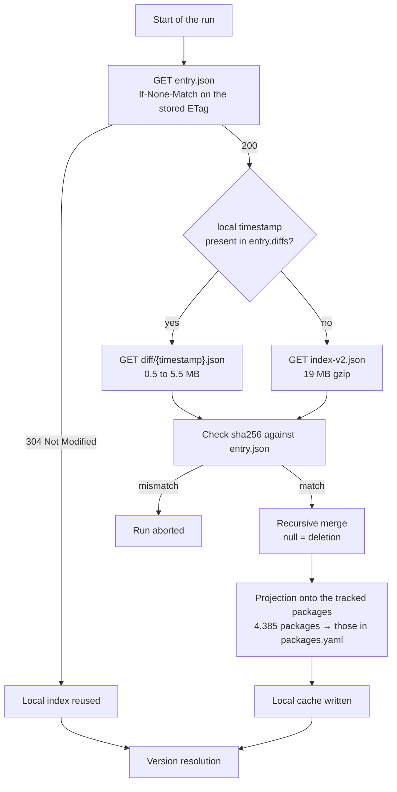
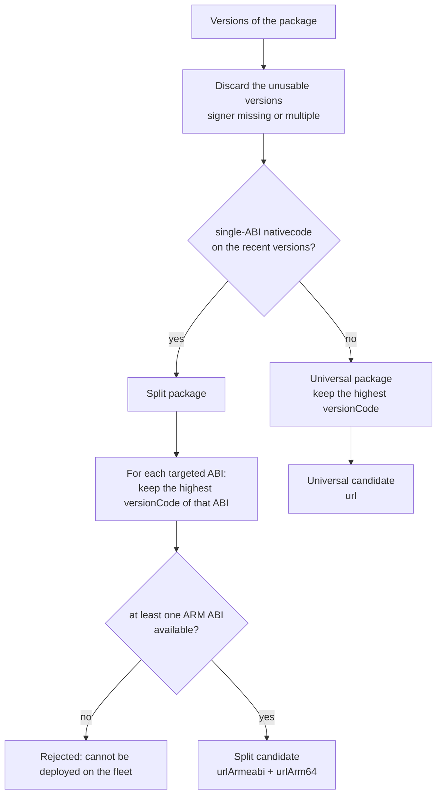

# Iteration 2 — F-Droid client, version resolution, `sync --dry-run`

> **Status: delivered.** A discovery made during implementation changed the selection rule described in §4.2:
> the `releaseChannels` field of the index marks the pre-releases, and discarding them before comparing the
> `versionCode` values reproduces F-Droid's `suggestedVersionCode` exactly (checked on 12 packages). Without this
> filter, Nextcloud would have been published as `35.0.0 RC2` instead of `34.1.1`. The notion of a "version
> group" considered in §4.2 turned out to be useless: filtering the versions that offer the target ABI and
> taking the highest `versionCode` is enough, and removes the need to group by `versionName`.
>
> **Archive document.** The `mirror` option that appears in the configuration examples no longer exists:
> Headwind will never host the APKs, and iteration 5 is abandoned (architecture §8).

## TL;DR

Add the F-Droid half of the service: fetch the repository index as cheaply as possible, derive from it the
candidate version of each tracked package **taking the architecture into account**, and display the update
plan. No write to Headwind, no APK downloaded.

Done when: `poetry run fhm sync --dry-run` says, for each tracked package, what it would publish and why — or
why it would publish nothing.

---

## 1. Scope

### In this iteration

| Element | Content |
| --- | --- |
| F-Droid client | Conditional `entry.json`, full index, incremental diffs, sha256 check |
| Index cache | Local index reused from one run to the next |
| Version resolution | Choice of the candidate version or versions, grouped by ABI |
| `sync --dry-run` command | Displays the plan, writes nothing |
| Signer pinning | Capture of `expected_signer` on the first successful resolution |

### Outside this iteration

| Element | Iteration |
| --- | --- |
| APK download and sha256 check | 3 |
| Actual rejection on a signer mismatch | 3 |
| Version creation in Headwind | 4 |
| APK upload (mirror mode) | 5 |
| Linking to the configurations | 6 |

The signer and the ABIs are **read and displayed** from this iteration on, even though they are only enforced
in iteration 3. This is what makes it possible to discover a problematic package before any write path exists.

---

## 2. The index format

Actual structure observed on `https://f-droid.org/repo/index-v2.json`:

```json
{
  "repo": { "timestamp": 1789478586569, "address": "https://f-droid.org/repo" },
  "packages": {
    "org.videolan.vlc": {
      "metadata": {
        "name": { "en-US": "VLC" },
        "preferredSigner": "80535be61eedb9a03b0476a6f493d496c3498770404339ea7a8000f5e61d22c0",
        "lastUpdated": 1789400000000
      },
      "versions": {
        "<APK sha256>": {
          "added": 1789475328195,
          "file": { "name": "/org.videolan.vlc_13070106.apk", "sha256": "...", "size": 4069621 },
          "manifest": {
            "versionName": "3.7.1",
            "versionCode": 13070106,
            "nativecode": ["arm64-v8a"],
            "usesSdk": { "minSdkVersion": 21, "targetSdkVersion": 35 },
            "signer": { "sha256": ["8053...22c0"] }
          },
          "antiFeatures": { "NonFreeNet": {} }
        }
      }
    }
  }
}
```

Points to keep in mind for the implementation:

| Field | Note |
| --- | --- |
| `versions` key | The sha256 of the APK, not a version number |
| `manifest.versionCode` | Integer, the only valid basis for comparison |
| `manifest.signer.sha256` | **Array** — cardinality 1 required (§4.3) |
| `manifest.nativecode` | Missing for a pure Java package; a list of ABIs otherwise |
| `file.name` | Path relative to the repository: the URL is `repo_url + file.name` |
| `file.sha256` | Hash of the APK, used in iteration 3 |
| `antiFeatures` | Present at the version level; basis for a filtering policy |

---

## 3. Fetching the index

### Three-stage strategy



### Rationale

The official repository weighs 19 MB gzipped and 60 MB uncompressed, for 4,385 packages. Downloading it every
day to watch a dozen packages is disproportionate, hence the conditional path. Diffs are offered over a 14-day
window (`maxAge`): a daily service stays within that window, and the fallback to the full index only happens
after a prolonged interruption.

### Merging a diff

A `null` value means "delete this key". One observed diff removed 158 versions this way. A naive merge with
`dict.update` would keep versions removed from the repository and could offer them for publication.

```python
def merge(base: dict, patch: dict) -> dict:
    for key, value in patch.items():
        if value is None:
            base.pop(key, None)
        elif isinstance(value, dict) and isinstance(base.get(key), dict):
            merge(base[key], value)
        else:
            base[key] = value
    return base
```

This is the first test to write for this module, with a nested deletion case.

### Local cache: projected onto the tracked packages

The repository describes 4,385 packages, and the service only tracks a handful of them. The index is therefore
**never kept in full**: it is projected onto the packages declared in `packages.yaml` right after the merge,
and only that projection is written to disk.

Measurements for 8 tracked packages, on the index of 2026-09-16:

| Content kept | Size | Ratio |
| --- | --- | --- |
| Full index | 60 MB | reference |
| Projection onto the 8 tracked packages | 1.29 MB | 1/46 |
| Projection + useful fields only | 115 kB | 1/518 |

The cache size mostly depends on the **number of versions kept in the history of each package**, not on the
number of packages: a real run on three packages (VLC, Nextcloud, Fennec) produces 552 kB, Fennec alone keeping
a large history. Expect a few hundred kilobytes, against 60 MB for the whole index.

#### Fields kept

The projection explicitly keeps:

| Level | Keys kept |
| --- | --- |
| `metadata` | `preferredSigner`, `name`, `lastUpdated` |
| version | `added`, `file`, `manifest`, `antiFeatures` |

`manifest` is kept whole: it carries `versionCode`, `versionName`, `nativecode`, `signer` and `usesSdk`, the
latter serving a possible SDK compatibility check. The presentation fields (`description`, `screenshots`,
`icon`, `categories`) and the source archives (`src`, `whatsNew`) are discarded.

This list is explicit, not "everything but": a later iteration that needs a missing field must add it here,
rather than find out at run time that it is missing.

#### Invalidation when the tracking list grows

A projected cache only contains the packages tracked when it was written. **Adding a package to
`packages.yaml` therefore makes it impossible to find in the cache**, and a diff does not fill the gap: a diff
only carries what changed in the repository, not what is missing locally.

Without an explicit rule, a newly tracked package would be reported as "absent from F-Droid" until the next
full refresh — indistinguishable from a genuine absence.

Rule adopted: the set of tracked packages is persisted **with** the cache. On every run:

| Comparison | Consequence |
| --- | --- |
| Set unchanged or reduced | The cache remains valid, normal conditional path |
| Set extended | Cache invalidated, full refresh of the index |

#### Memory cost

The full refresh loads the index in memory before the projection: **peak measured at 482 MB for 0.5 s**. It
only happens on the first start, after the list has been extended, or after more than 14 days of interruption.
Allow about 1 GB of headroom for the process on that path; the nominal regime, for its part, makes do with the
projected cache.

This cost does not justify a streaming parser (`ijson`): the dependency and the complexity it brings do not pay
off for half a second on a rare path.

The cache lives outside the SQLite database (a dedicated file under `FHM_CACHE_DIR`), the database remaining
reserved for the business state.

---

## 4. Resolving the candidate version

This is the core of the iteration, and the place where a mistake costs the most: it would only show up at
installation time on the device.

### 4.1 The package shape follows from `nativecode`

Distribution measured over the 4,385 packages of the repository, based on the version with the highest
`versionCode`:

| Shape | Packages | Share |
| --- | --- | --- |
| No `nativecode` (pure Java) | 1,984 | 45% |
| Multi-ABI `nativecode` | 1,882 | 43% |
| Single-ABI `nativecode` (per-ABI publication) | 519 | 12% |

These figures classify each package by its most recent version, but **the shape is not a stable property of
the package**: a project can move from a universal APK to a per-ABI publication, or the other way round. The
shape is therefore determined **by the candidate version group alone**, never by the history.

A change of shape between the version published in Headwind and the candidate version flips the `split` flag of
the Headwind record: `sync --dry-run` flags it explicitly, since it is a structural change and not a mere
version bump.

### 4.2 The highest `versionCode` is a trap

For VLC, the four APKs of version 3.7.1 carry distinct `versionCode` values:

| `versionCode` | `nativecode` |
| --- | --- |
| 13070108 | `x86_64` |
| 13070107 | `x86` |
| 13070106 | `arm64-v8a` |
| 13070105 | `armeabi-v7a` |

The overall maximum is the **x86_64** APK. Of the 519 packages publishing per ABI, **238 have a highest
`versionCode` that is not the `arm64-v8a` one**: the trap therefore fires in nearly one case out of two.

This is not an F-Droid flaw: its client reads the index and filters by the ABI of the device before comparing.
The `GET /api/v1/packages/{pkg}` endpoint, on the other hand, is unusable here, since its entries only carry
`versionName` and `versionCode`:

```json
{ "suggestedVersionCode": 13070108,
  "packages": [ { "versionName": "3.7.1", "versionCode": 13070108 } ] }
```

No architecture information appears there, and its `suggestedVersionCode` points precisely at the x86_64 APK
with nothing to tell it apart. This is the decisive reason to stick to the index as the single source.

The algorithm groups by ABI before comparing:



### 4.3 Rejection rules

| Situation | Decision |
| --- | --- |
| Unreadable Headwind versions | Package skipped, never presented as an update |
| `signer.sha256` missing or of cardinality ≠ 1 | Version discarded |
| Split package offering no ABI from `target_abis` | Package rejected, alert — 16 packages of the repository are in this case (§6) |
| Signer differing from `expected_signer` | Flagged in iteration 2, **rejected** in iteration 3 |
| Blocking `antiFeatures` | According to the configured policy (§6) |

Requiring exactly one signer rather than arbitrating a list is a deliberate choice: none of the versions of the
4,385 packages surveyed declares several, so the rule discards nothing in practice and fails loudly if the
format changes.

The first rule deserves to be spelled out, since it concerns iteration 4. A failed Headwind read must **never**
be taken to mean "Headwind is behind": being unable to compare is not observing a lag. Without this distinction,
a mere network error would trigger a publication once the write path is in place. The package is therefore
skipped, with an `ERROR`-level event in the log.

### 4.4 Architecture mapping

Headwind only knows two architectures: `Application.ARCH_ARMEABI = "armeabi"` and
`Application.ARCH_ARM64 = "arm64"`.

| F-Droid ABI | Headwind field |
| --- | --- |
| `arm64-v8a` | `urlArm64` |
| `armeabi-v7a`, `armeabi` | `urlArmeabi` |
| `x86`, `x86_64`, `mips`, `riscv64`, … | ignored |

### 4.5 Progress marker for a split package

A split package has not one `versionCode` but one per ABI. The marker stored in `last_seen_version_code` is the
`versionCode` of the **first ABI of `target_abis`**, that is the reference ABI declared by the operator — and
not the maximum of the `versionCode` values selected.

The reason is an interaction with the configuration. If the marker were the maximum, reducing `target_abis`
from `[arm64-v8a, armeabi-v7a]` to `[arm64-v8a]` would make the marker *go down* whenever the removed ABI
carried the highest `versionCode`. A marker going backwards produces either a republication or an unjustified
"nothing to do", depending on the direction of the comparison. Yet the relative order of the `versionCode`
values across ABIs is not standardised: at VLC, `armeabi-v7a` is numbered below `arm64-v8a`, but nothing
guarantees it elsewhere.

Anchoring the marker to a named ABI keeps it stable when `target_abis` is extended, and turns a reduction into
an explicit and predictable change.

If the `versionName` values differ between the ABIs of a same group, the one of the reference ABI prevails —
Headwind only stores one version string per `ApplicationVersion`.

This marker is advanced **as soon as the resolution happens**, before the integrity check of the APK
(iteration 3). A version whose download fails therefore sees its marker move forward all the same. This is
consistent with its definition — "last version seen on F-Droid" — but it must never be used to decide on a
publication: that role belongs to `last_created_version_code` and `last_pushed_version_code`.

---

## 5. Signer pinning

`expected_signer` is `NULL` for all the rows created in iteration 1. This iteration bridges the gap between
that state and the enforcement planned in iteration 3.

| State | Behaviour of `sync --dry-run` |
| --- | --- |
| `expected_signer` at `NULL` | Displays the signer that **would** be pinned (`metadata.preferredSigner`, or failing that the one of the candidate version) and records it |
| `expected_signer` set and identical | Nothing to report |
| `expected_signer` set and different | Explicit alert; in iteration 2 the plan is still displayed, in iteration 3 the package is rejected |

Pinning is the only write of this iteration, and it only concerns the local database. A `NULL` is never
interpreted as a mismatch.

---

## 6. Added configuration

```yaml
repo:
  url: https://f-droid.org/repo
  fingerprint: 43238d512c1e5eb2d6569f4a3afbf5523418b82e0a3ed1552770abb9a9c9ccab

defaults:
  mirror: true
  auto_approve: false
  target_abis: [arm64-v8a]
  blocked_anti_features: []

packages:
  - pkg: com.pavelsof.wormhole
    target_abis: [arm64-v8a, armeabi-v7a]
```

| Key | Scope | Role |
| --- | --- | --- |
| `target_abis` | default or package | ABIs to publish for a split package, in order of preference — the first one also serves as the reference ABI (§4.5) |
| `blocked_anti_features` | default or package | Anti-features whose presence discards a version |

#### Value chosen for this fleet

The fleet is uniformly **`arm64-v8a`**, hence the default value `[arm64-v8a]`: a single ABI published, so a
single APK per version for the split packages, and an unambiguous progress marker (§4.5).

This choice costs little: of the 519 packages publishing per ABI, **503 offer an `arm64-v8a` APK**. The
remaining 16 — `com.pavelsof.wormhole` or `com.github.andremiras.qrscan` for example — only publish for
`armeabi-v7a` or `x86_64` and would be rejected.

For those, the operator can declare an explicit fallback at the package level, as in the example above. This
fallback remains a case-by-case decision: an `armeabi-v7a` APK runs on most `arm64-v8a` devices thanks to 32-bit
compatibility, but recent 64-bit SoCs no longer always offer it. The service therefore never enables it on its
own.

`blocked_anti_features` is **empty by default**, deliberately. Blocking `NonFreeNet` seems reasonable on a
corporate fleet, but this anti-feature marks any client of an online service: it would discard Nextcloud, even
though it is in the project's sample configuration. Filtering is therefore an explicit decision of the
operator, not a default that silently discards packages they declared themselves.

---

## 7. Expected output

```
$ poetry run fhm sync --dry-run

Index F-Droid: 4385 paquets, timestamp 1789478586569 (diff applique, 552 ko)

  org.mozilla.fennec_fdroid   MISE A JOUR
                              Headwind 128.0.1 (1280001) -> F-Droid 129.0.2 (1290002)
                              APK universel, 92,4 Mo
                              signataire conforme

  org.videolan.vlc            MISE A JOUR
                              Headwind 3.6.5 -> F-Droid 3.7.1
                              publication par ABI:
                                arm64-v8a    versionCode 13070106
                                armeabi-v7a  versionCode 13070105
                              signataire epingle a cette execution

  com.nextcloud.client        A JOUR
                              version 3.29.0 (30290090)

  org.example.rotated         REFUS
                              signataire divergent
                              epingle  cd3714b7...7197
                              candidat 80535be6...22c0

3 paquets a jour, 2 mises a jour possibles, 1 refus
Aucune ecriture effectuee (--dry-run)
```

The `--json` option and the exit codes follow the convention set by `status`:

| Code | Meaning |
| --- | --- |
| `0` | Nothing to do, or only publishable updates |
| `1` | At least one package rejected |
| `2` | Configuration error, unreachable repository, corrupted index |

---

## 8. Added structure

```
fdroid_headwind_mirror/
├── fdroid/
│   ├── client.py       # entry.json, index, diffs, sha256 check
│   ├── cache.py        # persistence of the local index
│   ├── models.py       # pydantic models of the v2 index
│   └── resolver.py     # candidate version choice, grouping by ABI
└── domain/
    └── planner.py      # Headwind <-> F-Droid comparison, update plan
```

`resolver.py` knows neither HTTP nor Headwind: it takes index models and returns a candidate. It is the module
that concentrates the risky rules, and it must be testable on frozen cases — VLC first.

---

## 9. Tests

No network connection, in line with iteration 1.

| Area | Cases covered |
| --- | --- |
| Diff merge | Addition, modification, deletion through `null`, nested deletion |
| Client | 304 on `entry.json`, diff/full index choice, sha256 mismatch, `maxAge` exceeded |
| Resolution | Pure Java package, multi-ABI, split (real VLC case), missing ARM ABI, missing or multiple signer |
| Pinning | `NULL` then capture, match, mismatch |
| Planning | Up to date, update available, rejection, paused package, package not resolved in Headwind |
| CLI | Text output, JSON output, exit codes, complete absence of writes |

A real extract of the index is frozen as test data rather than rebuilt by hand. The packages to keep, all
identified in the index of 2026-09-16:

| Package | Interest |
| --- | --- |
| `org.videolan.vlc` | Per-ABI publication, highest `versionCode` on x86_64 |
| `com.nextcloud.client` | Common case, `nativecode` missing or multi-ABI |
| `com.shatteredpixel.shatteredpixeldungeon` | Two distinct signers across versions |
| `de.schildbach.wallet` | Two signers, a case independent of the previous one |

The last two feed the rejection path of iteration 3: having a genuine case avoids testing a signer mismatch on
made-up data.

---

## 10. Implementation breakdown

| Step | Content | Verifiable through |
| --- | --- | --- |
| 2.1 | Pydantic models of the v2 index | Parsing of the frozen real extract |
| 2.2 | Diff merge | Tests of the `null` semantics |
| 2.3 | F-Droid client and cache | Tests on a simulated transport |
| 2.4 | Resolver | VLC, pure Java, multi-ABI and rejection cases |
| 2.5 | Signer pinning | `NULL` → value transition |
| 2.6 | `planner` and `sync --dry-run` | Text and JSON output, no Headwind write |

---

## 11. Points to settle before coding

1. ~~**ABI of the fleet.**~~ Settled: the fleet is uniformly `arm64-v8a`, hence `target_abis: [arm64-v8a]`
   (§6).
2. **Location of the index cache.** The projected cache weighs about 115 kB, but the full refresh needs ~1 GB
   of transient memory. `FHM_CACHE_DIR` remains to be set explicitly.
3. **`antiFeatures` policy.** Empty by default (§6). To be confirmed, or filled in if a corporate policy already
   exists on the subject.
