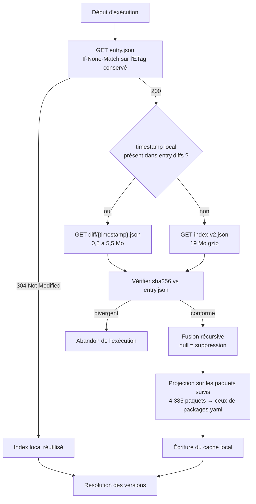
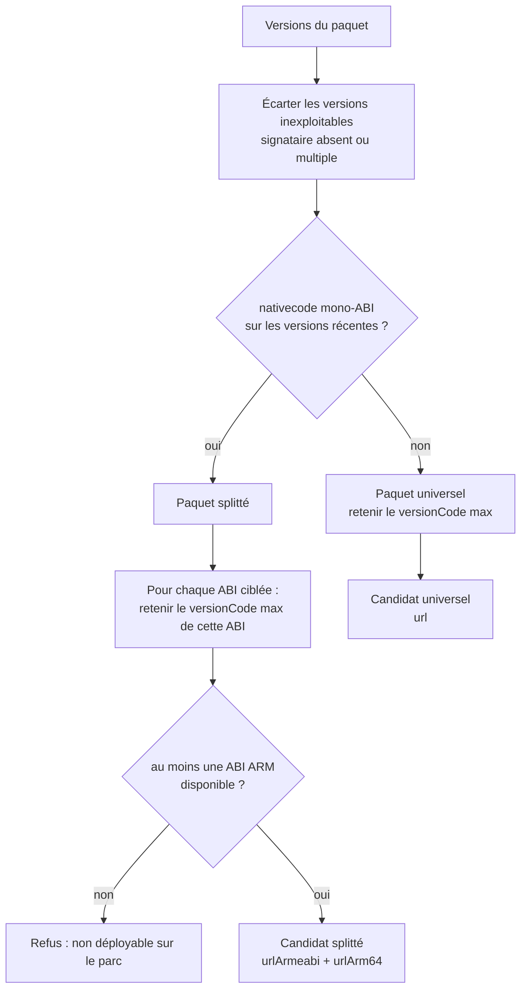

# Itération 2 — Client F-Droid, résolution de version, `sync --dry-run`

> **Statut : livrée.** Une découverte en cours d'implémentation a modifié la règle de sélection décrite en
> §4.2 : le champ `releaseChannels` de l'index marque les préversions, et les écarter avant de comparer les
> `versionCode` reproduit exactement le `suggestedVersionCode` de F-Droid (vérifié sur 12 paquets). Sans ce
> filtre, Nextcloud aurait été publié en `35.0.0 RC2` au lieu de `34.1.1`. La notion de « groupe de versions »
> envisagée en §4.2 s'est révélée inutile : filtrer les versions offrant l'ABI cible puis prendre le
> `versionCode` maximal suffit, et supprime le besoin de regrouper par `versionName`.
>
> **Document d'archive.** L'option `mirror` qui apparaît dans les exemples de configuration n'existe plus :
> Headwind n'hébergera jamais les APK et l'itération 5 est abandonnée (architecture §8).

## TL;DR

Ajouter la moitié F-Droid du service : récupérer l'index du dépôt à moindre coût, en déduire pour chaque
paquet suivi la version candidate **en tenant compte de l'architecture**, et afficher le plan de mise à jour.
Aucune écriture dans Headwind, aucun APK téléchargé.

Critère de fin : `poetry run fhm sync --dry-run` dit, pour chaque paquet suivi, ce qu'il publierait et
pourquoi — ou pourquoi il ne publierait rien.

---

## 1. Périmètre

### Dans l'itération

| Élément | Contenu |
| --- | --- |
| Client F-Droid | `entry.json` conditionnel, index complet, diffs incrémentaux, vérification sha256 |
| Cache d'index | Index local réutilisé d'une exécution à l'autre |
| Résolution de version | Choix de la ou des versions candidates, groupées par ABI |
| Commande `sync --dry-run` | Affiche le plan, n'écrit rien |
| Épinglage du signataire | Capture de `expected_signer` à la première résolution réussie |

### Hors itération

| Élément | Itération |
| --- | --- |
| Téléchargement de l'APK et vérification de son sha256 | 3 |
| Refus effectif sur signataire divergent | 3 |
| Création de version dans Headwind | 4 |
| Envoi de l'APK (mode miroir) | 5 |
| Rattachement aux configurations | 6 |

Le signataire et les ABI sont **lus et affichés** dès cette itération, même si leur application n'intervient
qu'en itération 3. C'est ce qui permet de découvrir un paquet problématique avant qu'un chemin d'écriture
n'existe.

---

## 2. Le format de l'index

Structure réelle relevée sur `https://f-droid.org/repo/index-v2.json` :

```json
{
  "repo": { "timestamp": 1789478586569, "address": "https://f-droid.org/repo" },
  "packages": {
    "org.videolan.vlc": {
      "metadata": {
        "name": { "en-US": "VLC" },
        "preferredSigner": "80535be61eedb9a03b0476a6f493d496c3498770404339ea7a8000f5e61d22c0",
        "lastUpdated": 1789400000000
      },
      "versions": {
        "<sha256 de l'APK>": {
          "added": 1789475328195,
          "file": { "name": "/org.videolan.vlc_13070106.apk", "sha256": "...", "size": 4069621 },
          "manifest": {
            "versionName": "3.7.1",
            "versionCode": 13070106,
            "nativecode": ["arm64-v8a"],
            "usesSdk": { "minSdkVersion": 21, "targetSdkVersion": 35 },
            "signer": { "sha256": ["8053...22c0"] }
          },
          "antiFeatures": { "NonFreeNet": {} }
        }
      }
    }
  }
}
```

Points à retenir pour l'implémentation :

| Champ | Remarque |
| --- | --- |
| clé de `versions` | Le sha256 de l'APK, pas un numéro de version |
| `manifest.versionCode` | Entier, seule base de comparaison valable |
| `manifest.signer.sha256` | **Tableau** — cardinalité 1 exigée (§4.3) |
| `manifest.nativecode` | Absent pour un paquet pur Java ; liste d'ABI sinon |
| `file.name` | Chemin relatif au dépôt : l'URL est `repo_url + file.name` |
| `file.sha256` | Empreinte de l'APK, utilisée en itération 3 |
| `antiFeatures` | Présent au niveau version ; base d'une politique de filtrage |

---

## 3. Récupération de l'index

### Stratégie en trois temps



### Justification

Le dépôt officiel pèse 19 Mo en gzip et 60 Mo décompressé, pour 4 385 paquets. Le télécharger chaque jour
afin de surveiller une dizaine de paquets est disproportionné, d'où le chemin conditionnel. Les diffs sont
proposés sur une fenêtre de 14 jours (`maxAge`) : un service quotidien reste dans cette fenêtre, et le repli
sur l'index complet ne survient qu'après une interruption prolongée.

### Fusion d'un diff

Une valeur `null` signifie « supprimer cette clé ». Un diff observé retirait 158 versions de cette manière.
Une fusion naïve par `dict.update` conserverait des versions retirées du dépôt et pourrait les proposer à la
publication.

```python
def merge(base: dict, patch: dict) -> dict:
    for key, value in patch.items():
        if value is None:
            base.pop(key, None)
        elif isinstance(value, dict) and isinstance(base.get(key), dict):
            merge(base[key], value)
        else:
            base[key] = value
    return base
```

C'est le premier test à écrire pour ce module, avec un cas de suppression imbriquée.

### Cache local : projeté sur les paquets suivis

Le dépôt décrit 4 385 paquets, le service n'en suit qu'une poignée. L'index n'est donc **jamais conservé
intégralement** : il est projeté sur les paquets déclarés dans `packages.yaml` immédiatement après la fusion,
et seule cette projection est écrite sur disque.

Mesures pour 8 paquets suivis, sur l'index du 2026-09-16 :

| Contenu conservé | Taille | Rapport |
| --- | --- | --- |
| Index complet | 60 Mo | référence |
| Projection sur les 8 paquets suivis | 1,29 Mo | 1/46 |
| Projection + champs utiles seulement | 115 ko | 1/518 |

La taille du cache dépend surtout du **nombre de versions historisées par paquet**, pas du nombre de paquets :
une exécution réelle sur trois paquets (VLC, Nextcloud, Fennec) produit 552 ko, Fennec conservant à lui seul
un historique important. Compter quelques centaines de kilo-octets, contre 60 Mo pour l'index entier.

#### Champs conservés

La projection retient explicitement :

| Niveau | Clés conservées |
| --- | --- |
| `metadata` | `preferredSigner`, `name`, `lastUpdated` |
| version | `added`, `file`, `manifest`, `antiFeatures` |

`manifest` est gardé entier : il porte `versionCode`, `versionName`, `nativecode`, `signer` et `usesSdk`,
ce dernier servant à une éventuelle vérification de compatibilité SDK. Sont écartés les champs de présentation
(`description`, `screenshots`, `icon`, `categories`) et les archives de sources (`src`, `whatsNew`).

Cette liste est explicite et non « tout sauf » : une itération ultérieure ayant besoin d'un champ absent doit
l'ajouter ici, plutôt que de le découvrir manquant à l'exécution.

#### Invalidation quand la liste de suivi s'élargit

Un cache projeté ne contient que les paquets suivis au moment de son écriture. **Ajouter un paquet à
`packages.yaml` le rend donc introuvable dans le cache**, et un diff ne comble pas le manque : un diff ne
transporte que ce qui a changé dans le dépôt, pas ce qui manque localement.

Sans règle explicite, un paquet nouvellement suivi serait rapporté « absent de F-Droid » jusqu'au prochain
rafraîchissement complet — indiscernable d'une véritable absence.

Règle retenue : l'ensemble des paquets suivis est persisté **avec** le cache. À chaque exécution :

| Comparaison | Conséquence |
| --- | --- |
| Ensemble inchangé ou réduit | Le cache reste valable, chemin conditionnel normal |
| Ensemble élargi | Cache invalidé, rafraîchissement complet de l'index |

#### Coût mémoire

Le rafraîchissement complet charge l'index en mémoire avant projection : **pic mesuré à 482 Mo pour 0,5 s**.
Il ne survient qu'au premier démarrage, après un élargissement de la liste, ou après plus de 14 jours
d'interruption. Prévoir environ 1 Go de marge pour le processus sur ce chemin ; le régime nominal, lui, se
contente du cache projeté.

Ce coût ne justifie pas un analyseur en flux (`ijson`) : la dépendance et la complexité qu'il introduit ne se
paient pas pour une demi-seconde sur un chemin rare.

Le cache vit hors de la base SQLite (fichier dédié sous `FHM_CACHE_DIR`), la base restant réservée à l'état
métier.

---

## 4. Résolution de la version candidate

C'est le cœur de l'itération, et l'endroit où une erreur est la plus coûteuse : elle ne se manifesterait
qu'à l'installation sur l'appareil.

### 4.1 La forme du paquet se déduit de `nativecode`

Répartition mesurée sur les 4 385 paquets du dépôt, d'après la version au `versionCode` le plus élevé :

| Forme | Paquets | Part |
| --- | --- | --- |
| Pas de `nativecode` (pur Java) | 1 984 | 45 % |
| `nativecode` multi-ABI | 1 882 | 43 % |
| `nativecode` mono-ABI (publication par ABI) | 519 | 12 % |

Ces chiffres classent chaque paquet d'après sa version la plus récente, mais **la forme n'est pas une
propriété stable du paquet** : un projet peut passer d'un APK universel à une publication par ABI, ou
l'inverse. La forme est donc déterminée **par le seul groupe de versions candidat**, jamais par l'historique.

Un changement de forme entre la version publiée dans Headwind et la version candidate fait basculer le
drapeau `split` de l'enregistrement Headwind : `sync --dry-run` le signale explicitement, car c'est une
modification de structure et pas une simple montée de version.

### 4.2 Le `versionCode` le plus élevé est un piège

Pour VLC, les quatre APK de la version 3.7.1 portent des `versionCode` distincts :

| `versionCode` | `nativecode` |
| --- | --- |
| 13070108 | `x86_64` |
| 13070107 | `x86` |
| 13070106 | `arm64-v8a` |
| 13070105 | `armeabi-v7a` |

Le maximum global est l'APK **x86_64**. Sur les 519 paquets publiant par ABI, **238 ont un `versionCode`
maximal qui n'est pas celui d'`arm64-v8a`** : le piège se déclenche donc dans près d'un cas sur deux.

Ce n'est pas un défaut de F-Droid : son client lit l'index et filtre par l'ABI de l'appareil avant de
comparer. En revanche, l'endpoint `GET /api/v1/packages/{pkg}` est inexploitable ici, car ses entrées ne
portent que `versionName` et `versionCode` :

```json
{ "suggestedVersionCode": 13070108,
  "packages": [ { "versionName": "3.7.1", "versionCode": 13070108 } ] }
```

Aucune information d'architecture n'y figure, et son `suggestedVersionCode` désigne précisément l'APK x86_64
sans que rien ne permette de le savoir. C'est la raison décisive de s'en tenir à l'index comme source unique.

L'algorithme groupe par ABI avant de comparer :



### 4.3 Règles de refus

| Situation | Décision |
| --- | --- |
| Versions Headwind illisibles | Paquet ignoré, jamais présenté comme une mise à jour |
| `signer.sha256` absent ou de cardinalité ≠ 1 | Version écartée |
| Paquet splitté ne proposant aucune ABI de `target_abis` | Paquet refusé, alerte — 16 paquets du dépôt sont dans ce cas (§6) |
| Signataire divergent de `expected_signer` | Signalé en itération 2, **refusé** en itération 3 |
| `antiFeatures` bloquantes | Selon politique configurée (§6) |

Exiger exactement un signataire plutôt qu'arbitrer une liste est un choix délibéré : aucune des versions des
4 385 paquets relevés n'en déclare plusieurs, donc la règle n'écarte rien en pratique et échoue bruyamment si
le format évolue.

La première règle mérite d'être explicitée, car elle porte sur l'itération 4. Une lecture Headwind en échec ne
doit **jamais** être assimilée à « Headwind est en retard » : ne pas pouvoir comparer n'est pas constater un
retard. Sans cette distinction, une simple erreur réseau déclencherait une publication une fois le chemin
d'écriture en place. Le paquet est donc ignoré, avec un événement de niveau `ERROR` au journal.

### 4.4 Correspondance des architectures

Headwind ne connaît que deux architectures : `Application.ARCH_ARMEABI = "armeabi"` et
`Application.ARCH_ARM64 = "arm64"`.

| ABI F-Droid | Champ Headwind |
| --- | --- |
| `arm64-v8a` | `urlArm64` |
| `armeabi-v7a`, `armeabi` | `urlArmeabi` |
| `x86`, `x86_64`, `mips`, `riscv64`, … | ignorées |

### 4.5 Repère de progression pour un paquet splitté

Un paquet splitté n'a pas un `versionCode` mais un par ABI. Le repère stocké dans `last_seen_version_code`
est le `versionCode` de la **première ABI de `target_abis`**, c'est-à-dire l'ABI de référence déclarée par
l'exploitant — et non le maximum des `versionCode` retenus.

La raison est une interaction avec la configuration. Si le repère était le maximum, réduire `target_abis` de
`[arm64-v8a, armeabi-v7a]` à `[arm64-v8a]` ferait *baisser* le repère dès lors que l'ABI retirée portait le
`versionCode` le plus élevé. Un repère en recul produit soit une republication, soit un « rien à faire »
injustifié, selon le sens de la comparaison. Or l'ordre relatif des `versionCode` entre ABI n'est pas
normalisé : chez VLC `armeabi-v7a` est numéroté sous `arm64-v8a`, mais rien ne le garantit ailleurs.

Ancrer le repère sur une ABI nommée le rend stable quand on élargit `target_abis`, et fait d'un rétrécissement
un changement explicite et prévisible.

Si les `versionName` divergent entre ABI d'un même groupe, celui de l'ABI de référence fait foi — Headwind ne
stocke qu'une chaîne de version par `ApplicationVersion`.

Ce repère est avancé **dès la résolution**, avant la vérification d'intégrité de l'APK (itération 3). Une
version dont le téléchargement échoue voit donc son repère progresser malgré tout. C'est cohérent avec sa
définition — « dernière version observée sur F-Droid » — mais il ne doit jamais servir à décider d'une
publication : ce rôle revient à `last_created_version_code` et `last_pushed_version_code`.

---

## 5. Épinglage du signataire

`expected_signer` est `NULL` pour toutes les lignes créées en itération 1. Cette itération comble l'écart
entre cet état et l'application prévue en itération 3.

| État | Comportement de `sync --dry-run` |
| --- | --- |
| `expected_signer` à `NULL` | Affiche le signataire qui **serait** épinglé (`metadata.preferredSigner`, à défaut celui de la version candidate) et l'enregistre |
| `expected_signer` renseigné et identique | Rien à signaler |
| `expected_signer` renseigné et divergent | Alerte explicite ; en itération 2 le plan reste affiché, en itération 3 le paquet est refusé |

L'épinglage est la seule écriture de cette itération, et elle ne concerne que la base locale. Un `NULL` n'est
jamais interprété comme une divergence.

---

## 6. Configuration ajoutée

```yaml
repo:
  url: https://f-droid.org/repo
  fingerprint: 43238d512c1e5eb2d6569f4a3afbf5523418b82e0a3ed1552770abb9a9c9ccab

defaults:
  mirror: true
  auto_approve: false
  target_abis: [arm64-v8a]
  blocked_anti_features: []

packages:
  - pkg: com.pavelsof.wormhole
    target_abis: [arm64-v8a, armeabi-v7a]
```

| Clé | Portée | Rôle |
| --- | --- | --- |
| `target_abis` | défaut ou paquet | ABI à publier pour un paquet splitté, par ordre de préférence — la première sert aussi d'ABI de référence (§4.5) |
| `blocked_anti_features` | défaut ou paquet | Anti-fonctionnalités dont la présence écarte une version |

#### Valeur retenue pour ce parc

Le parc est homogène en **`arm64-v8a`**, d'où la valeur par défaut `[arm64-v8a]` : une seule ABI publiée,
donc un seul APK par version pour les paquets splittés, et un repère de progression non ambigu (§4.5).

Ce choix est peu coûteux : sur les 519 paquets publiant par ABI, **503 proposent un APK `arm64-v8a`**. Les
16 restants — `com.pavelsof.wormhole` ou `com.github.andremiras.qrscan` par exemple — ne publient qu'en
`armeabi-v7a` ou `x86_64` et seraient refusés.

Pour ceux-là, l'exploitant peut déclarer un repli explicite au niveau du paquet, comme dans l'exemple
ci-dessus. Ce repli reste une décision au cas par cas : un APK `armeabi-v7a` s'exécute sur la plupart des
appareils `arm64-v8a` grâce à la compatibilité 32 bits, mais les SoC 64 bits récents ne la proposent plus
toujours. Le service ne l'active donc jamais de lui-même.

`blocked_anti_features` est **vide par défaut**, délibérément. Bloquer `NonFreeNet` paraît raisonnable sur un
parc d'entreprise, mais cette anti-fonctionnalité marque tout client d'un service en ligne : elle écarterait
Nextcloud, pourtant présent dans l'exemple de configuration du projet. Le filtrage est donc une décision
explicite de l'exploitant, pas un défaut qui écarte silencieusement des paquets qu'il a lui-même déclarés.

---

## 7. Sortie attendue

```
$ poetry run fhm sync --dry-run

Index F-Droid: 4385 paquets, timestamp 1789478586569 (diff applique, 552 ko)

  org.mozilla.fennec_fdroid   MISE A JOUR
                              Headwind 128.0.1 (1280001) -> F-Droid 129.0.2 (1290002)
                              APK universel, 92,4 Mo
                              signataire conforme

  org.videolan.vlc            MISE A JOUR
                              Headwind 3.6.5 -> F-Droid 3.7.1
                              publication par ABI:
                                arm64-v8a    versionCode 13070106
                                armeabi-v7a  versionCode 13070105
                              signataire epingle a cette execution

  com.nextcloud.client        A JOUR
                              version 3.29.0 (30290090)

  org.example.rotated         REFUS
                              signataire divergent
                              epingle  cd3714b7...7197
                              candidat 80535be6...22c0

3 paquets a jour, 2 mises a jour possibles, 1 refus
Aucune ecriture effectuee (--dry-run)
```

Les options `--json` et les codes de sortie suivent la convention posée par `status` :

| Code | Signification |
| --- | --- |
| `0` | Rien à faire, ou uniquement des mises à jour publiables |
| `1` | Au moins un paquet refusé |
| `2` | Erreur de configuration, dépôt injoignable, index corrompu |

---

## 8. Structure ajoutée

```
fdroid_headwind_mirror/
├── fdroid/
│   ├── client.py       # entry.json, index, diffs, verification sha256
│   ├── cache.py        # persistance de l'index local
│   ├── models.py       # modeles pydantic de l'index v2
│   └── resolver.py     # choix de la version candidate, regroupement par ABI
└── domain/
    └── planner.py      # confrontation Headwind <-> F-Droid, plan de mise a jour
```

`resolver.py` ne connaît ni HTTP ni Headwind : il prend des modèles d'index et rend un candidat. C'est le
module qui concentre les règles à risque, et il doit être testable sur des cas figés — VLC en tête.

---

## 9. Tests

Aucune connexion réseau, conformément à l'itération 1.

| Domaine | Cas couverts |
| --- | --- |
| Fusion de diff | Ajout, modification, suppression par `null`, suppression imbriquée |
| Client | 304 sur `entry.json`, choix diff/index complet, sha256 divergent, `maxAge` dépassé |
| Résolution | Paquet pur Java, multi-ABI, splitté (cas VLC réel), ABI ARM absente, signataire absent ou multiple |
| Épinglage | `NULL` puis capture, conformité, divergence |
| Planification | À jour, mise à jour disponible, refus, paquet en pause, paquet non résolu dans Headwind |
| CLI | Sortie texte, sortie JSON, codes de sortie, absence totale d'écriture |

Un extrait réel de l'index est figé comme donnée de test plutôt que reconstruit à la main. Les paquets à
retenir, tous identifiés dans l'index du 2026-09-16 :

| Paquet | Intérêt |
| --- | --- |
| `org.videolan.vlc` | Publication par ABI, `versionCode` maximal sur x86_64 |
| `com.nextcloud.client` | Cas courant, `nativecode` absent ou multi-ABI |
| `com.shatteredpixel.shatteredpixeldungeon` | Deux signataires distincts selon les versions |
| `de.schildbach.wallet` | Deux signataires, cas indépendant du précédent |

Les deux derniers alimentent le chemin de refus de l'itération 3 : disposer d'un cas authentique évite de
tester une divergence de signataire sur une donnée inventée.

---

## 10. Découpage d'implémentation

| Étape | Contenu | Vérifiable par |
| --- | --- | --- |
| 2.1 | Modèles pydantic de l'index v2 | Parsing de l'extrait réel figé |
| 2.2 | Fusion de diff | Tests de la sémantique `null` |
| 2.3 | Client F-Droid et cache | Tests sur transport simulé |
| 2.4 | Resolver | Cas VLC, pur Java, multi-ABI, refus |
| 2.5 | Épinglage du signataire | Transition `NULL` → valeur |
| 2.6 | `planner` et `sync --dry-run` | Sortie texte et JSON, aucune écriture Headwind |

---

## 11. Points à trancher avant de coder

1. ~~**ABI du parc.**~~ Tranché : parc homogène `arm64-v8a`, d'où `target_abis: [arm64-v8a]` (§6).
2. **Emplacement du cache d'index.** Le cache projeté pèse environ 115 ko, mais le rafraîchissement complet
   demande ~1 Go de mémoire transitoire. `FHM_CACHE_DIR` reste à fixer explicitement.
3. **Politique `antiFeatures`.** Vide par défaut (§6). À confirmer, ou à renseigner si une politique
   d'entreprise existe déjà sur le sujet.
